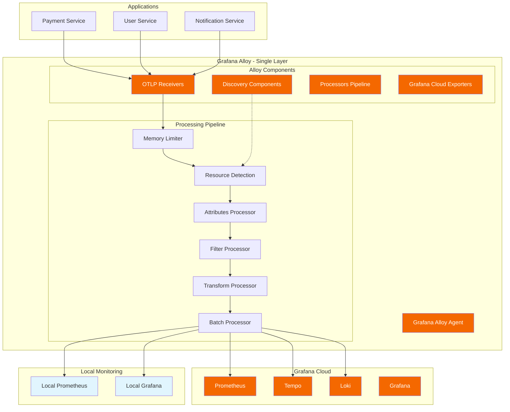

# Grafana Alloy Dynamic Processors Lab

[](https://grafana.com/docs/alloy/)
[](https://opentelemetry.io/)
[](https://grafana.com/cloud/)

> **Grafana Alloy version** of the OpenTelemetry Dynamic Processors Lab - featuring advanced resource detection, intelligent labeling strategies, intelligent sorting capabilities, and seamless Grafana Cloud integration using Grafana's vendor-agnostic distribution of the OpenTelemetry Collector.

## 🌟 What Makes This Alloy Version Special

This Alloy implementation provides **identical core functionality** to the original OTel Collector version but optimized for **Grafana Cloud users** who want:

- ✅ **Vendor-Agnostic**: Uses Grafana Alloy (vendor-agnostic OTel distribution)
- ✅ **River Configuration**: Modern HCL-like syntax for better readability
- ✅ **Grafana Cloud Optimized**: Built-in support for Grafana Cloud services
- ✅ **Lightweight & Composable**: Better resource utilization and scaling
- ✅ **Full-Stack Integration**: Seamless integration with Grafana observability stack

## 📚 Table of Contents

- [🚀 Quick Start](#-quick-start)
- [🤖 AI-Driven Intelligent Sorting](#-ai-driven-intelligent-sorting)
- [🏗️ Architecture Overview](#️-architecture-overview)
- [🔧 Alloy vs OTel Collector](#-alloy-vs-otel-collector)
- [⚙️ Configuration](#️-configuration)
- [🚀 Deployment](#-deployment)
- [🧪 Testing](#-testing)
- [📊 Monitoring](#-monitoring)
- [🔄 Migration Guide](#-migration-guide)
- [🛠️ Troubleshooting](#️-troubleshooting)

## 🚀 Quick Start

### Step 1: Configure Environment

```bash
# Clone and navigate to Alloy directory
cd alloy/

# Update your Grafana Cloud credentials
cat > ../.env << EOF
# Grafana Cloud Configuration
GRAFANA_CLOUD_INSTANCE_ID=123456
GRAFANA_CLOUD_API_KEY=glc_your_api_key_here
GRAFANA_CLOUD_PROMETHEUS_URL=https://prometheus-prod-01-eu-west-0.grafana.net/api/prom/push
GRAFANA_CLOUD_TEMPO_URL=https://tempo-prod-04-eu-west-0.grafana.net:443
GRAFANA_CLOUD_LOKI_URL=https://logs-prod-006.grafana.net/loki/api/v1/push

# Application Configuration
APP_NAME=alloy-otel-lab
APP_VERSION=1.0.0
ENVIRONMENT=development
SERVICE_NAMESPACE=alloy-monitoring
CLUSTER_NAME=local-alloy-cluster
REGION=us-west-2

# AI Sorter Configuration (optional)
GROK_API_KEY=your-grok-api-key-here
AI_SORTER_ENABLED=false
EOF
```

### Step 2: Deploy Alloy Stack

```bash
# Deploy with enhanced sorting configuration
./scripts/deploy-alloy.sh deploy

# Check status
./scripts/deploy-alloy.sh status

# View logs
./scripts/deploy-alloy.sh logs
```

### Step 3: Run Tests

```bash
# Run comprehensive test suite
./scripts/test-alloy.sh

# Run specific tests
./scripts/test-alloy.sh sorting
./scripts/test-alloy.sh performance
```

### Step 4: Access Services

- **Grafana Alloy UI**: http://localhost:12345
- **Grafana Dashboard**: http://localhost:3000 (admin/admin)
- **Prometheus**: http://localhost:9090
- **Health Check**: http://localhost:13133
- **Metrics**: http://localhost:8889/metrics

## 🤖 AI-Driven Intelligent Sorting

This feature adds a FastAPI sidecar to classify and route telemetry data using an AI API (e.g., xAI Grok). It processes logs, metrics, or traces, assigns categories (e.g., critical, info), and forwards them to appropriate destinations.

### Features

- **🧠 AI-Powered Classification**: Uses xAI Grok API to intelligently classify telemetry data
- **🎯 Smart Routing**: Routes data based on AI classification to different destinations:
  - **Critical**: High-priority data sent to alerting systems
  - **Warning**: Medium-priority data sent to storage
  - **Info**: Low-priority data sent to archive
- **🔄 Real-time Processing**: FastAPI sidecar processes telemetry in real-time
- **🛡️ Secure**: API keys managed through Kubernetes secrets
- **📊 Monitoring**: Built-in health checks and metrics

### Quick Setup

1. **Enable AI Sorter**:
   ```bash
   # Set in your .env file
   AI_SORTER_ENABLED=true
   GROK_API_KEY=your-grok-api-key-here
   ```

2. **Deploy with AI Sorting**:
   ```bash
   # Deploy with AI sorter configuration
   ./scripts/deploy-alloy.sh deploy --config ai_sorter
   
   # Or build AI sorter image separately
   ./scripts/deploy-alloy.sh build-ai
   ```

3. **Kubernetes Deployment**:
   ```bash
   # Create secret for API key
   kubectl create secret generic ai-sorter-secrets \
     --from-literal=grok-api-key=your-grok-api-key-here
   
   # Deploy with Helm
   helm upgrade alloy helm/ --set aiSorter.enabled=true
   ```

### Configuration

Configure Alloy to use AI sorting in your River configuration:

```hcl
// Use the ai_sorter.river configuration
otelcol.receiver.otlp "default" {
    // ... receiver config
}

otelcol.processor.batch "ai_batch" {
    // Batches data for AI analysis
}

otelcol.processor.routing "ai_router" {
    // Routes based on AI classification
    from_attribute = "ai.forward_to"
    
    table = [
        { value = "alerting", pipelines = ["alerting"] },
        { value = "storage", pipelines = ["storage"] },
        { value = "archive", pipelines = ["archive"] },
    ]
}
```

### Example

- Logs with "error" patterns are classified as "critical" and sent to Alertmanager
- Performance metrics are classified as "warning" and sent to long-term storage
- Debug logs are classified as "info" and sent to archive storage

### API Endpoints

The AI sorter sidecar exposes:
- `POST /sort` - Classify telemetry data
- `GET /health` - Health check endpoint

## 🏗️ Architecture Overview



## 🔧 Alloy vs OTel Collector

### Key Differences

| Feature | OTel Collector | Grafana Alloy |
|---------|----------------|---------------|
| **Configuration Syntax** | YAML | River (HCL-like) |
| **Architecture** | Multi-layer (Collector + Processor) | Single agent |
| **Resource Usage** | Higher memory footprint | Optimized for efficiency |
| **Grafana Integration** | Manual configuration | Built-in optimizations |
| **Service Discovery** | Limited | Advanced Kubernetes/Docker discovery |
| **UI/Debugging** | Basic | Rich UI and debugging tools |

### Configuration Comparison

**OTel Collector (YAML):**
```yaml
processors:
  resourcedetection:
    detectors: [docker, system, process]
    docker:
      resource_attributes:
        host.name:
          enabled: true
```

**Grafana Alloy (River):**
```hcl
otelcol.processor.resourcedetection "default" {
  detectors = ["docker", "system", "process"]
  
  docker {
    resource_attributes {
      host_name {
        enabled = true
      }
    }
  }
}
```

## ⚙️ Configuration

### Available Configurations

1. **Enhanced with Sorting** (`enhanced-with-sort.alloy`)
   - Full dynamic processing pipeline
   - Intelligent sorting capabilities
   - Business priority rules

2. **Basic Template** (`basic-template.alloy`)
   - Minimal configuration
   - Standard resource detection
   - Basic filtering

3. **Production Example** (`grafana-cloud-production.alloy`)
   - Production-optimized settings
   - Advanced security features
   - Cost optimization

### Key Components

#### Resource Detection
```hcl
otelcol.processor.resourcedetection "default" {
  detectors = ["docker", "system", "process", "env"]
  
  docker {
    resource_attributes {
      host_name { enabled = true }
      container_image_name { enabled = true }
      container_image_tag { enabled = true }
    }
  }
}
```

#### Intelligent Labeling
```hcl
otelcol.processor.attributes "default" {
  action {
    key           = "grafana.service.name"
    from_attribute = "service.name"
    action        = "insert"
  }
  
  action {
    key     = "service.base_name"
    from_attribute = "service.name"
    action  = "extract"
    pattern = "^(.*)-(dev|staging|prod)$"
    to_attributes = ["service.base_name", "service.environment"]
  }
}
```

#### Intelligent Sorting
```hcl
otelcol.processor.transform "default" {
  trace_statements {
    statement = "set(attributes[\"sort.business_priority\"], 10) where resource.attributes[\"service.name\"] == \"payment-service\""
  }
  
  trace_statements {  
    statement = "set(attributes[\"sort.priority\"], 2) where span.status.code == SPAN_STATUS_CODE_ERROR"
  }
}
```

#### Environment-Based Filtering
```hcl
otelcol.processor.filter "default" {
  traces {
    span {
      span_statement = "resource.attributes[\"environment\"] == \"dev\""
    }
  }
}
```

## 🚀 Deployment

### Docker Compose Deployment

```bash
# Basic deployment
./scripts/deploy-alloy.sh deploy

# With custom configuration
./scripts/deploy-alloy.sh deploy --config basic-template

# Production deployment
./scripts/deploy-alloy.sh deploy --config grafana-cloud-production
```

### Kubernetes Deployment

```bash
# TODO: Create Helm chart for Alloy
# kubectl apply -f alloy/k8s/
```

### Configuration Selection

```bash
# Use enhanced configuration (default)
./scripts/deploy-alloy.sh deploy --config enhanced-with-sort

# Use basic configuration
./scripts/deploy-alloy.sh deploy --config basic-template

# Use production configuration
./scripts/deploy-alloy.sh deploy --config grafana-cloud-production
```

## 🧪 Testing

### Comprehensive Test Suite

```bash
# Run all tests
./scripts/test-alloy.sh

# Test specific functionality
./scripts/test-alloy.sh connectivity
./scripts/test-alloy.sh resource
./scripts/test-alloy.sh labeling
./scripts/test-alloy.sh filtering
./scripts/test-alloy.sh sorting
./scripts/test-alloy.sh metrics
./scripts/test-alloy.sh performance
```

### Test Results Example

```
==================================================
  Grafana Alloy Dynamic Processors Test Suite
==================================================
[TEST] Testing basic connectivity
[PASS] Health endpoint responding
[PASS] OTLP HTTP endpoint accepting requests
[PASS] Metrics endpoint serving data
[PASS] Alloy UI endpoint responding

[TEST] Testing intelligent sorting
[PASS] Low priority span sent first
[PASS] High priority span sent second

[TEST] Testing performance under load
[PASS] Performance test: 100/100 spans sent successfully in 1250ms

==============================================
  Test Summary
==============================================
Total Tests: 10
Passed: 10
Failed: 0

All tests passed! ✓
```

## 📊 Monitoring

### Alloy Metrics

```bash
# View Alloy metrics
curl http://localhost:8889/metrics | grep otelcol_processor

# Key metrics to monitor
otelcol_processor_accepted_spans_total
otelcol_processor_dropped_spans_total  
otelcol_processor_batch_batch_size
```

### Grafana Dashboards

Access pre-configured dashboards at:
- **Local Grafana**: http://localhost:3000
- **Grafana Cloud**: Your Grafana Cloud instance

### Health Checks

```bash
# Alloy health
curl http://localhost:13133

# Service status
./scripts/deploy-alloy.sh status
```

## 🔄 Migration Guide

### From OTel Collector to Alloy

1. **Configuration Migration**
   ```bash
   # Automatic conversion (conceptual)
   alloy convert --source-format=otelcol --target-format=alloy \
     config/processor-config-enhanced.yaml > alloy/configs/migrated.alloy
   ```

2. **Environment Variables**
   - Same environment variables work
   - No changes needed to `.env` file

3. **Docker Compose**
   - Use `alloy-docker-compose.yml` instead of `docker-compose-enhanced.yaml`
   - Same ports and volumes

4. **Testing**
   - Use `./alloy/scripts/test-alloy.sh` instead of `./scripts/test-sort-processor.sh`

### Migration Checklist

- [ ] Update configuration syntax (YAML → River)
- [ ] Test resource detection functionality
- [ ] Verify intelligent labeling works
- [ ] Confirm filtering rules
- [ ] Test sorting capabilities
- [ ] Validate Grafana Cloud integration
- [ ] Run performance tests
- [ ] Update monitoring dashboards

## 🛠️ Troubleshooting

### Common Issues

#### Alloy Container Won't Start
```bash
# Check container logs
docker logs grafana-alloy

# Verify configuration syntax
# alloy fmt --verify alloy/configs/enhanced-with-sort.alloy
```

#### Resource Detection Not Working
```bash
# Check Docker socket permissions
ls -la /var/run/docker.sock

# Verify container runs as root
docker exec grafana-alloy id
```

#### Grafana Cloud Connection Issues
```bash
# Test credentials
curl -u "${GRAFANA_CLOUD_INSTANCE_ID}:${GRAFANA_CLOUD_API_KEY}" \
  "${GRAFANA_CLOUD_PROMETHEUS_URL}/api/v1/labels"

# Check TLS configuration
./scripts/test-alloy.sh cloud
```

#### Sorting Not Working
```bash
# Check sorted traces file
cat tmp/sorted-traces.json | jq '.resourceSpans[].scopeSpans[].spans[] | .attributes."sort.business_priority"'

# Verify transform processor
curl http://localhost:8889/metrics | grep transform
```

### Debug Commands

```bash
# Enable debug logging
export LOG_LEVEL=debug
./scripts/deploy-alloy.sh restart

# Check processing pipeline
curl http://localhost:55679/debug/tracez

# View detailed metrics
curl http://localhost:8889/metrics
```

### Performance Tuning

```hcl
// Increase batch sizes for higher throughput
otelcol.processor.batch "default" {
  send_batch_size     = 2048
  timeout             = "5s"
  send_batch_max_size = 4096
}

// Increase memory limits
otelcol.processor.memory_limiter "default" {
  limit_mib      = 2048
  spike_limit_mib = 512
}
```

## 🎯 Advanced Features

### Service Mesh Integration

```hcl
// Istio/Envoy integration
otelcol.processor.attributes "mesh" {
  action {
    key           = "mesh.service.name"
    from_attribute = "http.headers.x-envoy-original-dst-host"
    action        = "insert"
  }
}
```

### Business Logic Processing

```hcl
// Custom business rules
otelcol.processor.transform "business" {
  trace_statements {
    statement = "set(attributes[\"business.transaction.value\"], attributes[\"order.total\"] * attributes[\"currency.rate\"]) where span.kind == \"server\""
  }
}
```

### Security & Compliance

```hcl
// PII masking
otelcol.processor.attributes "security" {
  action {
    key     = "user.email"
    pattern = "^(.{2}).*@(.*)$"
    action  = "update"
    value   = "$1***@$2"
  }
}
```

## 🌟 Benefits of Alloy Version

1. **Simplified Architecture**: Single agent instead of multi-layer setup
2. **Better Performance**: Optimized resource usage and processing
3. **Modern Configuration**: River syntax is more readable and maintainable
4. **Grafana Integration**: Built-in optimizations for Grafana Cloud
5. **Advanced Discovery**: Better Kubernetes and Docker integration
6. **Rich UI**: Built-in debugging and monitoring interface
7. **Vendor Agnostic**: Can work with any OpenTelemetry-compatible backend

## 🤝 Contributing

Contributions to the Alloy version are welcome! Please:

1. Test your changes with `./scripts/test-alloy.sh`
2. Update documentation as needed
3. Follow River configuration best practices
4. Ensure compatibility with Grafana Cloud

## 📚 Resources

- [Grafana Alloy Documentation](https://grafana.com/docs/alloy/)
- [River Configuration Language](https://grafana.com/docs/alloy/latest/reference/config-language/)
- [OpenTelemetry Components](https://grafana.com/docs/alloy/latest/reference/components/otelcol/)
- [Grafana Cloud Integration](https://grafana.com/docs/grafana-cloud/send-data/otlp/)

---

**Happy Processing with Grafana Alloy!** 🚀

*This Alloy version provides identical functionality to the original OTel Collector implementation while being optimized for Grafana Cloud users and modern observability workflows.*