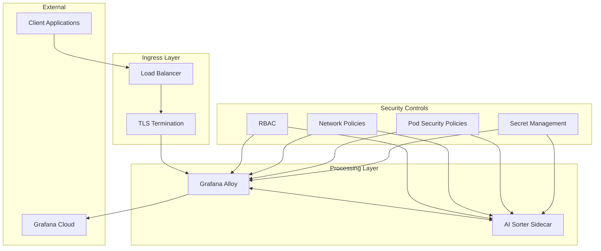

# Security Policy

## Overview

The alloy-dynamic-processors project implements enterprise-grade security controls for observability data processing using Grafana Alloy. This document outlines our security model, threat analysis, and procedures for maintaining a secure deployment.

## Table of Contents

- [Security Model](#security-model)
- [Threat Model](#threat-model)
- [Security Controls](#security-controls)
- [Deployment Security](#deployment-security)
- [Data Protection](#data-protection)
- [Vulnerability Management](#vulnerability-management)
- [Incident Response](#incident-response)
- [Compliance](#compliance)
- [Reporting Security Issues](#reporting-security-issues)

---

## Security Model

### Security Principles

Our security model is built on the following principles:

1. **Defense in Depth**: Multiple layers of security controls
2. **Least Privilege**: Minimal required permissions for all components
3. **Zero Trust**: Never trust, always verify
4. **Data Minimization**: Collect and retain only necessary data
5. **Transparency**: Security through visibility and monitoring

### Security Architecture



---

## Threat Model

### Assets

**Primary Assets:**
- Observability data (logs, metrics, traces)
- API keys and authentication tokens
- Configuration data
- AI model outputs and classifications

**Supporting Assets:**
- Kubernetes cluster infrastructure
- Container images and registries
- CI/CD pipelines
- Documentation and source code

### Threat Actors

**External Threats:**
- Nation-state actors
- Organized cybercriminals
- Opportunistic attackers
- Competitors

**Internal Threats:**
- Malicious insiders
- Compromised accounts
- Accidental exposure
- Misconfigured systems

### Attack Vectors

**Network-based Attacks:**
- Man-in-the-middle attacks on telemetry data
- DDoS attacks on ingestion endpoints
- Network reconnaissance and lateral movement
- Protocol exploitation

**Container/Kubernetes Attacks:**
- Container escape attempts
- Privilege escalation
- Resource exhaustion
- Supply chain attacks on container images

**API/Application Attacks:**
- Injection attacks (SQL, command, etc.)
- Authentication bypass
- Authorization vulnerabilities
- API abuse and rate limiting bypass

### Risk Assessment

| Threat | Likelihood | Impact | Risk Level | Mitigation |
|--------|------------|---------|------------|------------|
| Data Exfiltration | Medium | High | **High** | Encryption, Access Controls, Monitoring |
| Service Disruption | High | Medium | **High** | Rate Limiting, Load Balancing, Redundancy |
| Privilege Escalation | Low | High | **Medium** | RBAC, Pod Security, Runtime Security |
| Supply Chain Attack | Low | High | **Medium** | Image Scanning, Signature Verification |
| Configuration Drift | Medium | Medium | **Medium** | GitOps, Policy as Code, Drift Detection |

---

## Security Controls

### Authentication and Authorization

**Identity Management:**
- Kubernetes ServiceAccount-based authentication
- RBAC with principle of least privilege
- Integration with enterprise identity providers (LDAP/SAML)
- API key rotation and lifecycle management

**Access Controls:**
```yaml
# Example RBAC configuration
apiVersion: rbac.authorization.k8s.io/v1
kind: Role
metadata:
  name: alloy-processor
rules:
- apiGroups: [""]
  resources: ["configmaps", "secrets"]
  verbs: ["get", "list"]
- apiGroups: [""]
  resources: ["pods"]
  verbs: ["get", "list", "watch"]
```

### Network Security

**Network Segmentation:**
- Kubernetes Network Policies for micro-segmentation
- Ingress controllers with TLS termination
- Service mesh integration (Istio/Linkerd) for mTLS
- Firewall rules and security groups

**Traffic Encryption:**
- TLS 1.3 for all external communications
- mTLS for inter-service communication
- End-to-end encryption for telemetry data
- Certificate lifecycle management

```yaml
# Example Network Policy
apiVersion: networking.k8s.io/v1
kind: NetworkPolicy
metadata:
  name: alloy-network-policy
spec:
  podSelector:
    matchLabels:
      app: alloy
  policyTypes:
  - Ingress
  - Egress
  ingress:
  - from:
    - podSelector:
        matchLabels:
          role: telemetry-source
    ports:
    - protocol: TCP
      port: 4317
    - protocol: TCP
      port: 4318
```

### Container and Runtime Security

**Container Security:**
- Non-root container execution
- Read-only root filesystems
- Minimal container images (distroless)
- Resource limits and quotas
- Security context constraints

**Runtime Protection:**
- Pod Security Standards enforcement
- Runtime security monitoring
- Admission controllers for policy enforcement
- Container image vulnerability scanning

```yaml
# Example Pod Security Context
securityContext:
  runAsNonRoot: true
  runAsUser: 1000
  runAsGroup: 1000
  fsGroup: 1000
  seccompProfile:
    type: RuntimeDefault
  capabilities:
    drop:
    - ALL
```

### Data Protection

**Data Encryption:**
- Encryption at rest for persistent volumes
- Encryption in transit for all communications
- Key management integration (HashiCorp Vault, AWS KMS)
- Encrypted backups and archives

**Data Classification:**
- Automatic PII detection and classification
- Data retention policies
- Geographic data residency controls
- Data masking and anonymization

**Sensitive Information Handling:**
- Secret management using Kubernetes secrets or external vaults
- API key rotation and secure distribution
- Secure configuration management
- Audit logging for sensitive operations

---

## Deployment Security

### Secure Configuration

**Base Configurations:**
```yaml
# Security-hardened Alloy configuration
apiVersion: v1
kind: ConfigMap
metadata:
  name: alloy-security-config
data:
  config.river: |
    // Security-focused receiver configuration
    otelcol.receiver.otlp "secure" {
      grpc {
        endpoint = "0.0.0.0:4317"
        tls {
          cert_file = "/etc/certs/server.crt"
          key_file  = "/etc/certs/server.key"
          ca_file   = "/etc/certs/ca.crt"
          client_ca_file = "/etc/certs/ca.crt"
        }
      }
    }
    
    // Memory limiter for DoS protection
    otelcol.processor.memory_limiter "security" {
      limit_mib = 512
      spike_limit_mib = 128
    }
```

**Security Hardening Checklist:**
- [ ] TLS/mTLS enabled for all communications
- [ ] Non-root container execution configured
- [ ] Resource limits and quotas set
- [ ] Network policies applied
- [ ] RBAC permissions minimized
- [ ] Secrets properly managed
- [ ] Security monitoring enabled
- [ ] Backup and recovery procedures tested

### Infrastructure Security

**Kubernetes Security:**
- Regular cluster updates and patching
- etcd encryption at rest
- Audit logging enabled
- Pod Security Standards enforcement
- Network policies for segmentation
- Service mesh for zero-trust networking

**Cloud Security:**
- IAM roles with minimal permissions
- VPC/network isolation
- Security groups and NACLs
- CloudTrail/audit logging
- Encrypted storage and databases
- Regular security assessments

---

## Data Protection

### Privacy Controls

**Personal Data Handling:**
- Automatic PII detection and masking
- Consent management for data collection
- Right to erasure implementation
- Data minimization practices
- Cross-border transfer controls

**Data Retention:**
```yaml
# Example data retention policy
data_retention:
  logs:
    default: "30d"
    security: "1y"
    audit: "7y"
  metrics:
    default: "90d"
    billing: "3y"
  traces:
    default: "7d"
    error: "30d"
```

### Compliance Integration

**Regulatory Compliance:**
- GDPR compliance controls
- SOC 2 Type II requirements
- HIPAA safeguards (where applicable)
- PCI DSS requirements (where applicable)
- Industry-specific regulations

**Audit and Reporting:**
- Comprehensive audit logging
- Automated compliance reporting
- Evidence collection procedures
- Regular compliance assessments
- Third-party audit support

---

## Vulnerability Management

### Vulnerability Assessment

**Continuous Scanning:**
- Container image vulnerability scanning
- Dependency vulnerability assessment
- Infrastructure security scanning
- Configuration drift detection
- Runtime security monitoring

**Assessment Schedule:**
- **Critical**: Immediate response required
- **High**: Remediation within 24 hours
- **Medium**: Remediation within 7 days
- **Low**: Remediation within 30 days

### Patch Management

**Update Procedures:**
1. **Vulnerability Identification**: Automated scanning and monitoring
2. **Risk Assessment**: Impact and exploitability analysis
3. **Testing**: Patch validation in staging environment
4. **Deployment**: Coordinated rollout with rollback capability
5. **Verification**: Post-deployment validation and monitoring

**Emergency Patching:**
- Out-of-band patching for critical vulnerabilities
- Emergency change approval process
- Rapid deployment and validation procedures
- Communication and stakeholder notification

---

## Incident Response

### Security Incident Classification

**Severity Levels:**
- **P0 - Critical**: Active data breach or system compromise
- **P1 - High**: Potential data exposure or service disruption
- **P2 - Medium**: Security policy violation or suspicious activity
- **P3 - Low**: Minor security concerns or informational alerts

### Response Procedures

**Immediate Response (0-1 hour):**
1. Incident identification and triage
2. Initial containment measures
3. Stakeholder notification
4. Evidence preservation
5. Communication coordination

**Investigation Phase (1-24 hours):**
1. Detailed forensic analysis
2. Root cause identification
3. Impact assessment
4. Additional containment measures
5. Recovery planning

**Recovery Phase (24-72 hours):**
1. System restoration and validation
2. Security control enhancement
3. Lessons learned documentation
4. Process improvement implementation
5. Stakeholder communication

### Communication Plan

**Internal Communication:**
- Security team notification (immediate)
- Engineering team notification (within 1 hour)
- Management notification (within 2 hours)
- Legal/compliance notification (within 4 hours)

**External Communication:**
- Customer notification (as required by SLA)
- Regulatory notification (as required by law)
- Public disclosure (if necessary)
- Partner/vendor notification (as appropriate)

---

## Compliance

### Standards and Frameworks

**Security Frameworks:**
- NIST Cybersecurity Framework
- ISO 27001/27002
- CIS Controls
- OWASP Security Guidelines
- Cloud Security Alliance (CSA)

**Compliance Requirements:**
- SOC 2 Type II
- GDPR (General Data Protection Regulation)
- HIPAA (Health Insurance Portability and Accountability Act)
- PCI DSS (Payment Card Industry Data Security Standard)
- FedRAMP (Federal Risk and Authorization Management Program)

### Audit and Assessment

**Regular Assessments:**
- Annual third-party security assessments
- Quarterly internal security reviews
- Monthly vulnerability assessments
- Weekly configuration reviews
- Daily security monitoring and alerting

**Documentation Requirements:**
- Security policy documentation
- Procedure and process documentation
- Incident response documentation
- Training and awareness documentation
- Technical configuration documentation

---

## Reporting Security Issues

### Responsible Disclosure

We encourage responsible disclosure of security vulnerabilities. Please follow these guidelines:

**Reporting Process:**
1. **Email**: Send detailed reports to security@grafana.com
2. **Encryption**: Use PGP encryption for sensitive reports
3. **Information**: Include detailed reproduction steps and impact assessment
4. **Coordination**: Work with our security team for responsible disclosure
5. **Recognition**: Security researchers will be acknowledged (with permission)

**What to Include:**
- Detailed description of the vulnerability
- Steps to reproduce the issue
- Potential impact and exploitation scenarios
- Suggested remediation approaches
- Contact information for follow-up

**Response Timeline:**
- **Initial Response**: Within 24 hours
- **Triage and Assessment**: Within 72 hours
- **Resolution Timeline**: Based on severity (see vulnerability management)
- **Disclosure Coordination**: 90 days or upon fix deployment

### Bug Bounty Program

We maintain a responsible disclosure program with the following scope:

**In Scope:**
- Security vulnerabilities in alloy-dynamic-processors
- Container and Kubernetes security issues
- Authentication and authorization bypasses
- Data exposure or privacy violations
- Injection vulnerabilities and code execution

**Out of Scope:**
- Social engineering attacks
- Physical security issues
- Denial of service attacks
- Issues in third-party dependencies (report to respective maintainers)
- Issues requiring privileged access to systems

---

## Security Contact Information

**Primary Security Contact:**
- Email: security@grafana.com
- PGP Key: [Available on keyserver]
- Response Time: 24 hours maximum

**Security Team:**
- **Chief Security Officer**: Available for escalation
- **Security Engineering**: Technical vulnerability assessment
- **Compliance Team**: Regulatory and audit requirements
- **Incident Response**: 24/7 security incident handling

---

## Security Resources

### Additional Documentation
- [Grafana Security Documentation](https://grafana.com/docs/grafana/latest/administration/security/)
- [Kubernetes Security Best Practices](https://kubernetes.io/docs/concepts/security/)
- [OWASP Container Security Guide](https://cheatsheetseries.owasp.org/cheatsheets/Docker_Security_Cheat_Sheet.html)
- [NIST Cybersecurity Framework](https://www.nist.gov/cyberframework)

### Security Tools and Integrations
- Container vulnerability scanning with Trivy
- Runtime security monitoring with Falco
- Network security with Istio service mesh
- Secret management with HashiCorp Vault
- Compliance monitoring with Open Policy Agent

---

*This security policy is reviewed and updated quarterly. Last updated: January 2025*