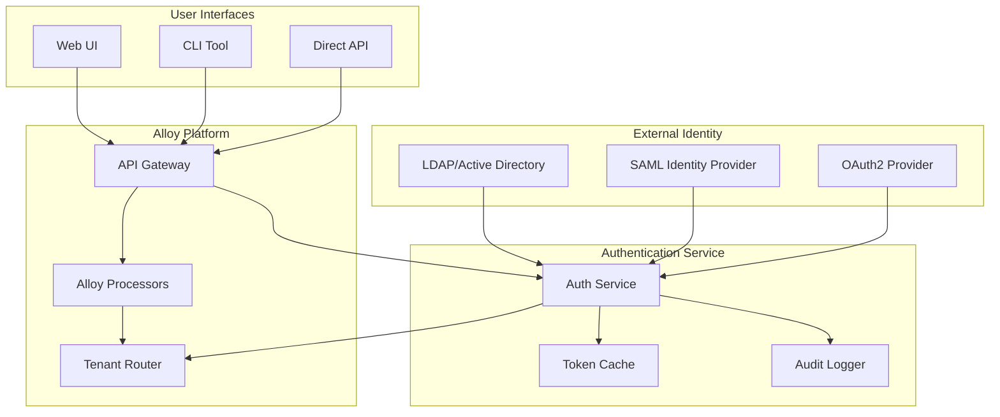

# Enterprise Authentication Service

## Overview

The Enterprise Authentication Service provides LDAP/SAML integration for the Alloy Dynamic Processors platform, enabling enterprise-grade authentication and authorization. This service acts as an authentication proxy between the observability platform and enterprise identity providers.

## Architecture

## Components

### 1. Authentication Service
- LDAP/AD integration for user lookup and group membership
- SAML SSO endpoint for identity provider integration
- JWT token generation and validation
- Role mapping from identity groups to platform roles

### 2. Authorization Engine
- Role-based access control (RBAC)
- Tenant-aware permissions
- Resource-level access control
- Policy evaluation engine

### 3. User Management Interface
- Self-service password reset
- Profile management
- Group membership display
- Access request workflows

### 4. Audit System
- Authentication event logging
- Authorization decision tracking
- Compliance reporting
- Security monitoring

## Deployment

The authentication service is deployed as a sidecar container alongside the Alloy deployment, providing authentication and authorization services for all platform components.