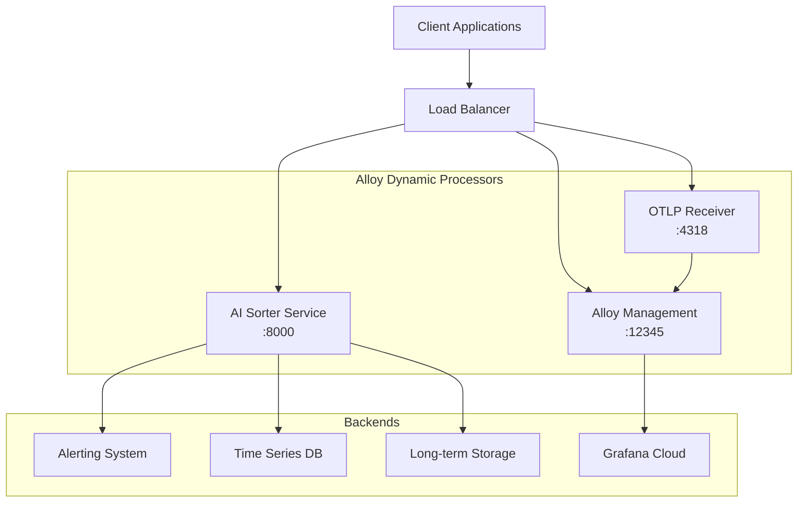

# Alloy Dynamic Processors API Documentation

> **Enterprise-Grade API Documentation for Grafana Alloy Dynamic Processors v1.7**

## 📖 Overview

The Alloy Dynamic Processors API provides comprehensive endpoints for:

- **🤖 AI Sorter Service**: Intelligent classification and routing of telemetry data
- **⚙️ Alloy Management**: Health checks, metrics, and operational endpoints  
- **📡 OTLP Ingestion**: OpenTelemetry Protocol data reception and processing
- **🔐 Enterprise Authentication**: Multi-tier security and access control

## 🚀 Interactive API Explorer

### Swagger UI
Access the interactive API documentation at:
```
http://localhost:8000/docs    # AI Sorter Swagger UI
http://localhost:12345/docs   # Alloy Management (if enabled)
```

### Redoc
Alternative documentation interface:
```
http://localhost:8000/redoc   # AI Sorter ReDoc
```

### OpenAPI Specification
- **File**: [`API_SPECIFICATION.yaml`](./API_SPECIFICATION.yaml)
- **Format**: OpenAPI 3.0.3
- **Validation**: Fully validated and enterprise-ready

## 🔗 Quick Start

### 1. AI Sorter Health Check
```bash
curl -X GET "http://localhost:8000/health" \
  -H "accept: application/json"
```

### 2. Sort Telemetry Data
```bash
curl -X POST "http://localhost:8000/sort" \
  -H "accept: application/json" \
  -H "Content-Type: application/json" \
  -H "X-API-Key: your-grok-api-key" \
  -d '{
    "items": [
      {
        "type": "error",
        "content": {
          "message": "Database connection failed",
          "severity": "high",
          "service": "user-service"
        }
      }
    ]
  }'
```

### 3. Alloy Health Check
```bash
curl -X GET "http://localhost:12345/-/healthy"
```

### 4. Ingest OTLP Traces
```bash
curl -X POST "http://localhost:4318/v1/traces" \
  -H "Content-Type: application/json" \
  -H "Authorization: Bearer your-token" \
  -d '{
    "resourceSpans": [
      {
        "resource": {},
        "scopeSpans": []
      }
    ]
  }'
```

## 📊 Service Architecture



## 🔐 Authentication Guide

### AI Sorter Authentication
The AI Sorter requires a Grok API key for AI-powered classification:

```bash
# Environment Variable
export GROK_API_KEY="your-grok-api-key-here"

# HTTP Header
curl -H "X-API-Key: your-grok-api-key-here" \
  http://localhost:8000/sort
```

### OTLP Authentication
OTLP endpoints support multiple authentication methods:

#### Bearer Token
```bash
curl -H "Authorization: Bearer your-jwt-token" \
  http://localhost:4318/v1/traces
```

#### Basic Authentication
```bash
curl -u "username:password" \
  http://localhost:4318/v1/traces
```

#### Kubernetes ServiceAccount
```yaml
apiVersion: v1
kind: ServiceAccount
metadata:
  name: telemetry-client
  annotations:
    kubernetes.io/service-account.token: "auto-generated-token"
```

### Grafana Cloud Integration
```bash
# Basic auth with Grafana Cloud credentials
curl -u "$GRAFANA_INSTANCE_ID:$GRAFANA_API_KEY" \
  "https://prometheus-prod-01-eu-west-0.grafana.net/api/prom/push"
```

## 📈 Rate Limiting

| Service | Rate Limit | Window |
|---------|------------|--------|
| AI Sorter | 100 requests/min | Per client IP |
| OTLP Ingestion | 10,000 requests/min | Per authenticated client |
| Management APIs | 1,000 requests/min | Per client IP |

Rate limit headers included in responses:
```
X-RateLimit-Limit: 100
X-RateLimit-Remaining: 95
X-RateLimit-Reset: 1642781400
```

## 🚨 Error Handling

### Standard Error Response Format
```json
{
  "error": "Human-readable error message",
  "details": "Detailed technical information",
  "code": "MACHINE_READABLE_ERROR_CODE",
  "timestamp": "2024-01-24T10:00:00Z",
  "request_id": "550e8400-e29b-41d4-a716-446655440000"
}
```

### Common Error Codes

| Code | HTTP Status | Description |
|------|-------------|-------------|
| `INVALID_REQUEST` | 400 | Malformed request data |
| `MISSING_API_KEY` | 401 | Authentication required |
| `RATE_LIMIT_EXCEEDED` | 429 | Too many requests |
| `AI_API_ERROR` | 500 | External AI service error |
| `SERVICE_UNAVAILABLE` | 503 | Service temporarily down |

### Error Examples

#### 400 Bad Request
```json
{
  "error": "Validation error",
  "details": "Items array cannot be empty",
  "code": "INVALID_REQUEST",
  "timestamp": "2024-01-24T10:00:00Z",
  "request_id": "req-123456"
}
```

#### 401 Unauthorized
```json
{
  "error": "Authentication required",
  "details": "GROK_API_KEY environment variable not set",
  "code": "MISSING_API_KEY",
  "timestamp": "2024-01-24T10:00:00Z",
  "request_id": "req-123457"
}
```

#### 429 Rate Limited
```json
{
  "error": "Rate limit exceeded",
  "details": "Maximum 100 requests per minute allowed",
  "code": "RATE_LIMIT_EXCEEDED",
  "timestamp": "2024-01-24T10:00:00Z",
  "request_id": "req-123458"
}
```

## 📝 Code Examples

### Python Client
```python
import requests
import json

class AlloyClient:
    def __init__(self, base_url, api_key):
        self.base_url = base_url
        self.api_key = api_key
        self.session = requests.Session()
        self.session.headers.update({
            'X-API-Key': api_key,
            'Content-Type': 'application/json'
        })
    
    def health_check(self):
        """Check AI Sorter health"""
        response = self.session.get(f"{self.base_url}/health")
        return response.json()
    
    def sort_telemetry(self, items):
        """Sort telemetry data using AI"""
        payload = {"items": items}
        response = self.session.post(f"{self.base_url}/sort", 
                                   json=payload)
        if response.status_code == 200:
            return response.json()
        else:
            raise Exception(f"API Error: {response.text}")

# Usage
client = AlloyClient("http://localhost:8000", "your-api-key")

# Health check
health = client.health_check()
print(f"Service status: {health['status']}")

# Sort telemetry
items = [
    {
        "type": "error",
        "content": {
            "message": "Database timeout",
            "severity": "high",
            "service": "payment-service"
        }
    }
]
sorted_items = client.sort_telemetry(items)
for item in sorted_items:
    print(f"Category: {item['category']}, Forward to: {item['forward_to']}")
```

### JavaScript/Node.js Client
```javascript
const axios = require('axios');

class AlloyClient {
    constructor(baseUrl, apiKey) {
        this.baseUrl = baseUrl;
        this.client = axios.create({
            baseURL: baseUrl,
            headers: {
                'X-API-Key': apiKey,
                'Content-Type': 'application/json'
            }
        });
    }

    async healthCheck() {
        try {
            const response = await this.client.get('/health');
            return response.data;
        } catch (error) {
            throw new Error(`Health check failed: ${error.message}`);
        }
    }

    async sortTelemetry(items) {
        try {
            const response = await this.client.post('/sort', { items });
            return response.data;
        } catch (error) {
            if (error.response) {
                throw new Error(`API Error: ${error.response.data.error}`);
            }
            throw error;
        }
    }
}

// Usage
const client = new AlloyClient('http://localhost:8000', 'your-api-key');

(async () => {
    try {
        // Health check
        const health = await client.healthCheck();
        console.log(`Service status: ${health.status}`);

        // Sort telemetry
        const items = [{
            type: 'metric',
            content: {
                name: 'memory_usage',
                value: 85.5,
                unit: 'percent',
                service: 'web-server'
            }
        }];

        const sortedItems = await client.sortTelemetry(items);
        sortedItems.forEach(item => {
            console.log(`Category: ${item.category}, Forward to: ${item.forward_to}`);
        });
    } catch (error) {
        console.error('Error:', error.message);
    }
})();
```

### Go Client
```go
package main

import (
    "bytes"
    "encoding/json"
    "fmt"
    "io"
    "net/http"
)

type AlloyClient struct {
    BaseURL string
    APIKey  string
    Client  *http.Client
}

type DataItem struct {
    Type    string                 `json:"type"`
    Content map[string]interface{} `json:"content"`
}

type BatchRequest struct {
    Items []DataItem `json:"items"`
}

type SortedItem struct {
    Item      DataItem `json:"item"`
    Category  string   `json:"category"`
    ForwardTo string   `json:"forward_to"`
}

func NewAlloyClient(baseURL, apiKey string) *AlloyClient {
    return &AlloyClient{
        BaseURL: baseURL,
        APIKey:  apiKey,
        Client:  &http.Client{},
    }
}

func (c *AlloyClient) doRequest(method, path string, body interface{}) (*http.Response, error) {
    var reqBody io.Reader
    if body != nil {
        jsonBody, err := json.Marshal(body)
        if err != nil {
            return nil, err
        }
        reqBody = bytes.NewBuffer(jsonBody)
    }

    req, err := http.NewRequest(method, c.BaseURL+path, reqBody)
    if err != nil {
        return nil, err
    }

    req.Header.Set("X-API-Key", c.APIKey)
    req.Header.Set("Content-Type", "application/json")

    return c.Client.Do(req)
}

func (c *AlloyClient) HealthCheck() (map[string]interface{}, error) {
    resp, err := c.doRequest("GET", "/health", nil)
    if err != nil {
        return nil, err
    }
    defer resp.Body.Close()

    var result map[string]interface{}
    err = json.NewDecoder(resp.Body).Decode(&result)
    return result, err
}

func (c *AlloyClient) SortTelemetry(items []DataItem) ([]SortedItem, error) {
    request := BatchRequest{Items: items}
    
    resp, err := c.doRequest("POST", "/sort", request)
    if err != nil {
        return nil, err
    }
    defer resp.Body.Close()

    if resp.StatusCode != 200 {
        var errorResp map[string]interface{}
        json.NewDecoder(resp.Body).Decode(&errorResp)
        return nil, fmt.Errorf("API error: %v", errorResp["error"])
    }

    var result []SortedItem
    err = json.NewDecoder(resp.Body).Decode(&result)
    return result, err
}

func main() {
    client := NewAlloyClient("http://localhost:8000", "your-api-key")

    // Health check
    health, err := client.HealthCheck()
    if err != nil {
        fmt.Printf("Health check failed: %v\n", err)
        return
    }
    fmt.Printf("Service status: %v\n", health["status"])

    // Sort telemetry
    items := []DataItem{
        {
            Type: "log",
            Content: map[string]interface{}{
                "level":   "ERROR",
                "message": "Connection refused",
                "service": "api-gateway",
            },
        },
    }

    sortedItems, err := client.SortTelemetry(items)
    if err != nil {
        fmt.Printf("Sort failed: %v\n", err)
        return
    }

    for _, item := range sortedItems {
        fmt.Printf("Category: %s, Forward to: %s\n", 
                   item.Category, item.ForwardTo)
    }
}
```

### cURL Examples

#### AI Sorter Complete Workflow
```bash
#!/bin/bash

API_BASE="http://localhost:8000"
API_KEY="your-grok-api-key"

echo "🔍 Checking AI Sorter health..."
curl -s -X GET "$API_BASE/health" | jq '.'

echo -e "\n🤖 Sorting mixed telemetry batch..."
curl -s -X POST "$API_BASE/sort" \
  -H "X-API-Key: $API_KEY" \
  -H "Content-Type: application/json" \
  -d '{
    "items": [
      {
        "type": "error",
        "content": {
          "message": "Database connection failed",
          "severity": "critical",
          "service": "user-service",
          "timestamp": "2024-01-24T10:00:00Z"
        }
      },
      {
        "type": "metric",
        "content": {
          "name": "cpu_usage",
          "value": 45.2,
          "unit": "percent",
          "host": "web-01"
        }
      },
      {
        "type": "trace",
        "content": {
          "span_name": "http_request",
          "duration_ms": 150,
          "status": "ok",
          "service": "api-gateway"
        }
      }
    ]
  }' | jq '.'
```

#### OTLP Data Ingestion
```bash
#!/bin/bash

OTLP_BASE="http://localhost:4318"
AUTH_TOKEN="your-bearer-token"

echo "📡 Sending OTLP traces..."
curl -s -X POST "$OTLP_BASE/v1/traces" \
  -H "Authorization: Bearer $AUTH_TOKEN" \
  -H "Content-Type: application/json" \
  -d '{
    "resourceSpans": [
      {
        "resource": {
          "attributes": [
            {
              "key": "service.name",
              "value": {"stringValue": "my-service"}
            }
          ]
        },
        "scopeSpans": [
          {
            "spans": [
              {
                "traceId": "12345678901234567890123456789012",
                "spanId": "1234567890123456",
                "name": "example-span",
                "startTimeUnixNano": "1642781400000000000",
                "endTimeUnixNano": "1642781401000000000"
              }
            ]
          }
        ]
      }
    ]
  }' | jq '.'
```

## 🔧 Development Setup

### Local Development
```bash
# Start AI Sorter service
cd alloy/processors/ai_sorter
export GROK_API_KEY="your-api-key"
python -m uvicorn ai_sorter:app --reload --port 8000

# Start Alloy with management endpoints
cd alloy
./scripts/deploy-alloy.sh local

# Verify services
curl http://localhost:8000/health
curl http://localhost:12345/-/healthy
curl http://localhost:4318/v1/traces -X POST -d '{}'
```

### Docker Compose
```yaml
version: '3.8'
services:
  ai-sorter:
    image: ghcr.io/chaoskyle/alloy-ai-sorter:latest
    ports:
      - "8000:8000"
    environment:
      - GROK_API_KEY=${GROK_API_KEY}
    healthcheck:
      test: ["CMD", "curl", "-f", "http://localhost:8000/health"]
      interval: 30s
      timeout: 10s
      retries: 3

  alloy:
    image: grafana/alloy:latest
    ports:
      - "12345:12345"
      - "4318:4318"
    volumes:
      - ./alloy/configs:/etc/alloy
    command: ["run", "/etc/alloy/main.alloy"]
```

## 📊 Monitoring & Observability

### Metrics Available
- `alloy_ai_sorter_requests_total` - Total AI classification requests
- `alloy_ai_sorter_request_duration_seconds` - Request processing time
- `alloy_ai_sorter_classification_accuracy` - AI classification accuracy
- `alloy_otlp_received_total` - Total OTLP data points received
- `alloy_component_controller_running_components` - Active Alloy components

### Health Check Endpoints
- `GET /health` - AI Sorter detailed health status
- `GET /-/healthy` - Alloy health (simple OK/NOT OK)
- `GET /-/ready` - Alloy readiness (ready to accept traffic)
- `GET /metrics` - Prometheus metrics (both services)

## 🔒 Security Best Practices

### API Key Management
```bash
# Use environment variables (not hardcoded)
export GROK_API_KEY="gsk_xxxxxxxxxxxxxxxxxxxx"

# Kubernetes secrets
kubectl create secret generic ai-sorter-secrets \
  --from-literal=grok-api-key="$GROK_API_KEY"
```

### Network Security
```yaml
# Network policy example
apiVersion: networking.k8s.io/v1
kind: NetworkPolicy
metadata:
  name: alloy-network-policy
spec:
  podSelector:
    matchLabels:
      app: alloy-dynamic-processors
  policyTypes:
  - Ingress
  - Egress
  ingress:
  - from:
    - podSelector:
        matchLabels:
          app: telemetry-client
    ports:
    - protocol: TCP
      port: 8000
    - protocol: TCP
      port: 4318
```

### TLS Configuration
```yaml
# Ingress with TLS
apiVersion: networking.k8s.io/v1
kind: Ingress
metadata:
  name: alloy-ingress
  annotations:
    cert-manager.io/cluster-issuer: letsencrypt-prod
spec:
  tls:
  - hosts:
    - alloy.example.com
    secretName: alloy-tls
  rules:
  - host: alloy.example.com
    http:
      paths:
      - path: /
        pathType: Prefix
        backend:
          service:
            name: alloy-service
            port:
              number: 8000
```

## 🚀 Performance Tuning

### Request Optimization
- **Batch Size**: Optimal batch size is 10-50 items for AI classification
- **Concurrent Requests**: AI Sorter supports up to 10 concurrent requests
- **Timeout Settings**: Default 30s timeout for AI API calls
- **Connection Pooling**: Use HTTP/2 for better connection efficiency

### Scaling Configuration
```yaml
# Horizontal Pod Autoscaler
apiVersion: autoscaling/v2
kind: HorizontalPodAutoscaler
metadata:
  name: ai-sorter-hpa
spec:
  scaleTargetRef:
    apiVersion: apps/v1
    kind: Deployment
    name: ai-sorter
  minReplicas: 2
  maxReplicas: 10
  metrics:
  - type: Resource
    resource:
      name: cpu
      target:
        type: Utilization
        averageUtilization: 70
  - type: Resource
    resource:
      name: memory
      target:
        type: Utilization
        averageUtilization: 80
```

## 📚 Additional Resources

- **OpenAPI Specification**: [`API_SPECIFICATION.yaml`](./API_SPECIFICATION.yaml)
- **Architecture Guide**: [`ARCHITECTURE.md`](./ARCHITECTURE.md)
- **Deployment Guide**: [`DEPLOYMENT_GUIDE.md`](./DEPLOYMENT_GUIDE.md)
- **Security Documentation**: [`../SECURITY.md`](../SECURITY.md)
- **Contributing Guidelines**: [`../CONTRIBUTING.md`](../CONTRIBUTING.md)

## 🆘 Support & Troubleshooting

### Common Issues

#### 1. AI Sorter Returns 401 Unauthorized
```bash
# Check API key configuration
kubectl get secret ai-sorter-secrets -o yaml
kubectl logs deployment/ai-sorter | grep "API key"
```

#### 2. OTLP Ingestion Fails
```bash
# Verify Alloy configuration
kubectl logs deployment/alloy | grep "otlp"
curl -v http://localhost:4318/v1/traces -X POST
```

#### 3. High Response Times
```bash
# Check AI API latency
kubectl logs deployment/ai-sorter | grep "AI API"
# Monitor resource usage
kubectl top pods
```

### Getting Help
- **GitHub Issues**: [Report bugs and feature requests](https://github.com/ChaosKyle/alloy-dynamic-processors/issues)
- **Documentation**: [Full documentation site](https://github.com/ChaosKyle/alloy-dynamic-processors)
- **Community**: [Grafana Community Slack](https://grafana.slack.com)

---

**Last Updated**: January 24, 2024  
**API Version**: 1.7.0  
**Documentation Version**: 1.0