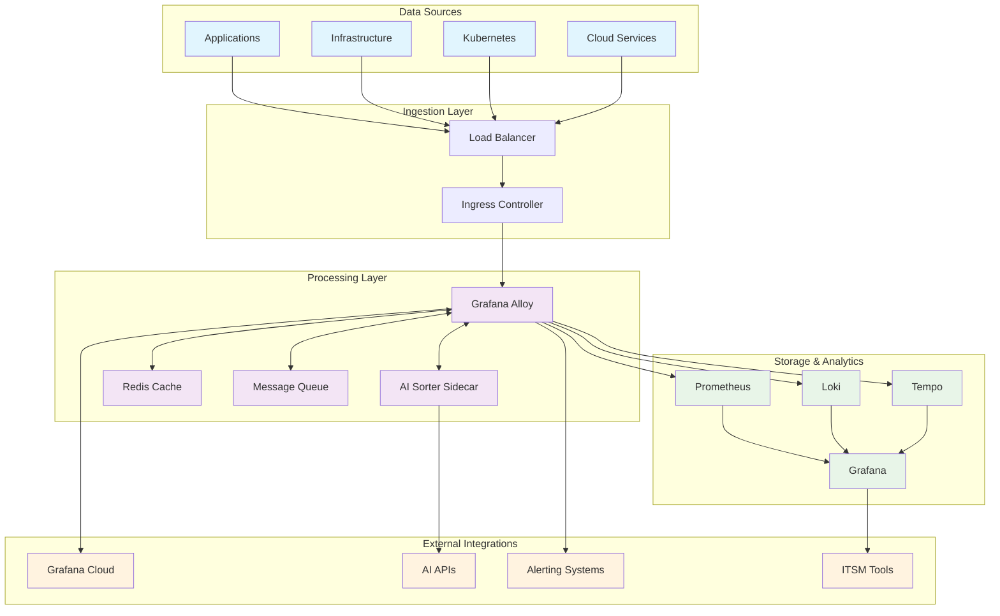
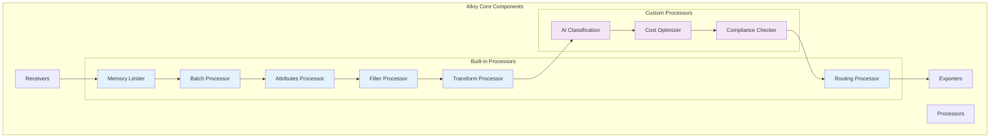
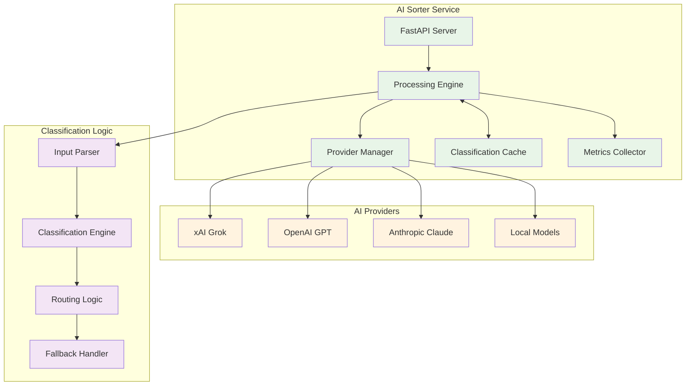
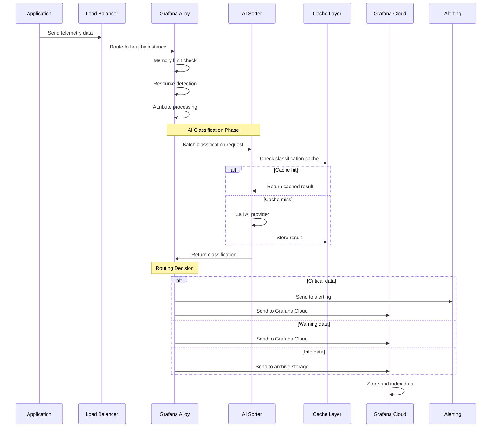
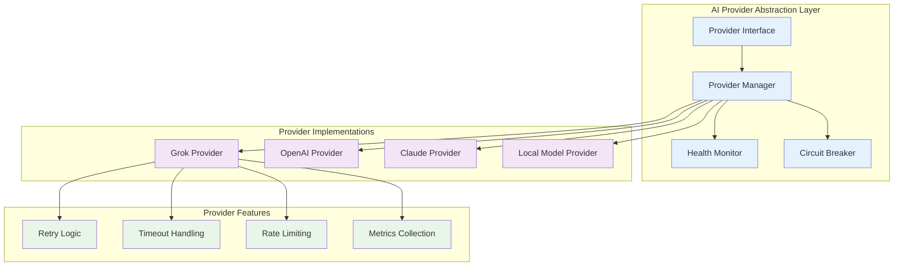
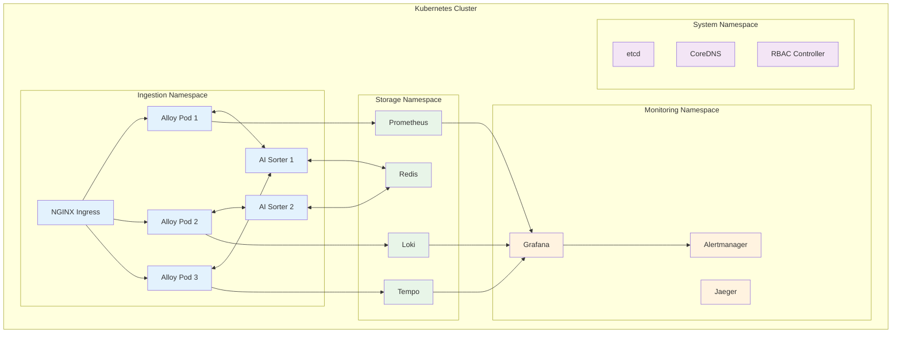
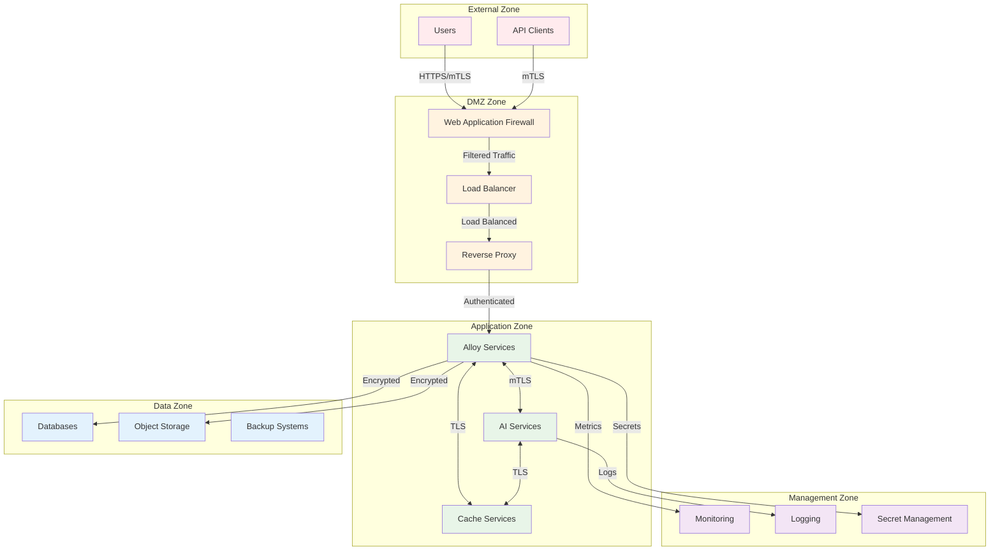
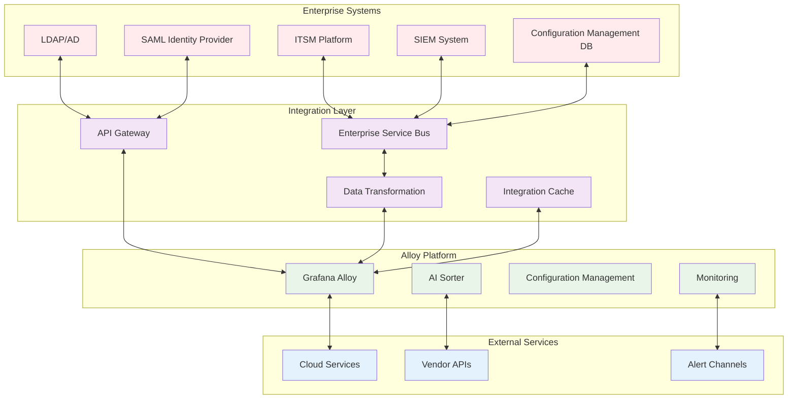
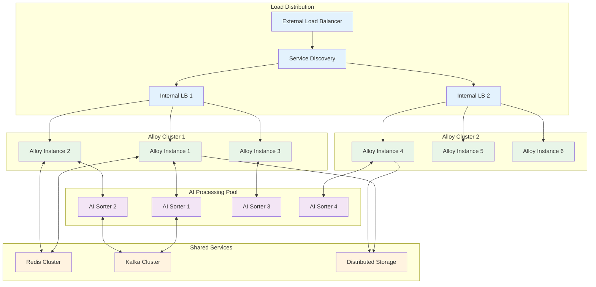

# Architecture Documentation

## Overview

The Alloy Dynamic Processors project implements an enterprise-grade observability data processing platform built on Grafana Alloy. This document provides comprehensive architectural guidance for implementation, scaling, and integration in enterprise environments.

## Table of Contents

- [System Architecture](#system-architecture)
- [Component Architecture](#component-architecture)
- [Data Flow Architecture](#data-flow-architecture)
- [AI Processing Architecture](#ai-processing-architecture)
- [Deployment Architecture](#deployment-architecture)
- [Security Architecture](#security-architecture)
- [Integration Architecture](#integration-architecture)
- [Scalability Architecture](#scalability-architecture)
- [Decision Records](#decision-records)

---

## System Architecture

### High-Level Overview



### System Boundaries

**Internal Components:**
- Grafana Alloy data processing engine
- AI Sorter classification service
- Configuration management system
- Local caching and queuing infrastructure

**External Dependencies:**
- Grafana Cloud services (Prometheus, Loki, Tempo)
- AI/ML APIs (xAI Grok, OpenAI, etc.)
- Kubernetes container orchestration
- Enterprise identity providers
- Monitoring and alerting systems

### Quality Attributes

| Attribute | Requirement | Implementation Strategy |
|-----------|-------------|------------------------|
| **Availability** | 99.99% uptime | Multi-zone deployment, health checks, auto-failover |
| **Scalability** | Handle 10M+ events/sec | Horizontal scaling, load balancing, partitioning |
| **Performance** | <100ms processing latency | In-memory caching, optimized data paths, batching |
| **Security** | Enterprise security controls | mTLS, RBAC, encryption, audit logging |
| **Reliability** | Zero data loss | Persistent queues, acknowledgments, retries |
| **Maintainability** | Modular, testable design | Clean architecture, comprehensive testing |

---

## Component Architecture

### Grafana Alloy Core



#### Receiver Components

**OTLP Receivers:**
- **HTTP Receiver** (Port 4318): REST API for telemetry ingestion
- **gRPC Receiver** (Port 4317): High-performance binary protocol
- **TLS Configuration**: mTLS for secure communications

**Specialized Receivers:**
- **Prometheus Receiver**: Scraping existing Prometheus endpoints
- **Kubernetes Receiver**: Native K8s event and metric collection
- **File Receiver**: Log file monitoring and ingestion

#### Processor Pipeline

**Memory Protection:**
```river
otelcol.processor.memory_limiter "protection" {
  limit_mib        = 1024
  spike_limit_mib  = 256
  check_interval   = "1s"
}
```

**Intelligent Batching:**
```river
otelcol.processor.batch "optimization" {
  send_batch_size     = 2048
  timeout             = "5s"
  send_batch_max_size = 4096
}
```

**Resource Detection:**
```river
otelcol.processor.resourcedetection "discovery" {
  detectors = ["docker", "k8s", "system", "env"]
  
  docker {
    resource_attributes {
      container_id { enabled = true }
      container_name { enabled = true }
      container_image_name { enabled = true }
    }
  }
  
  k8s {
    resource_attributes {
      k8s_namespace_name { enabled = true }
      k8s_pod_name { enabled = true }
      k8s_deployment_name { enabled = true }
    }
  }
}
```

### AI Sorter Architecture



#### AI Provider Integration

**Multi-Provider Strategy:**
```python
class AIProviderManager:
    def __init__(self):
        self.providers = [
            GrokProvider(priority=1, timeout=10),
            OpenAIProvider(priority=2, timeout=15),
            ClaudeProvider(priority=3, timeout=20),
            LocalModelProvider(priority=4, timeout=5)
        ]
    
    async def classify(self, data: TelemetryData) -> Classification:
        for provider in self.providers:
            try:
                if await provider.is_healthy():
                    return await provider.classify(data)
            except Exception as e:
                logger.warning(f"Provider {provider.name} failed: {e}")
                continue
        
        # Fallback to rule-based classification
        return self.fallback_classifier.classify(data)
```

**Classification Categories:**
- **Critical**: Security incidents, system failures, SLA breaches
- **Warning**: Performance degradation, capacity issues, minor errors
- **Info**: Regular operations, debug information, routine events

#### Caching Strategy

**Multi-Level Caching:**
```python
class ClassificationCache:
    def __init__(self):
        self.l1_cache = LRUCache(maxsize=1000)  # In-memory
        self.l2_cache = RedisCache(ttl=3600)    # Distributed
        self.l3_cache = FileCache(path="/cache") # Persistent
    
    async def get(self, key: str) -> Optional[Classification]:
        # Check L1 (fastest)
        result = self.l1_cache.get(key)
        if result:
            return result
            
        # Check L2 (distributed)
        result = await self.l2_cache.get(key)
        if result:
            self.l1_cache.set(key, result)
            return result
            
        # Check L3 (persistent)
        result = await self.l3_cache.get(key)
        if result:
            self.l1_cache.set(key, result)
            await self.l2_cache.set(key, result)
            return result
            
        return None
```

---

## Data Flow Architecture

### Telemetry Data Flow



### Data Processing Pipeline

**Stage 1: Ingestion**
```river
// High-performance OTLP receivers
otelcol.receiver.otlp "http" {
    http {
        endpoint = "0.0.0.0:4318"
        max_request_body_size = "10MB"
    }
}

otelcol.receiver.otlp "grpc" {
    grpc {
        endpoint = "0.0.0.0:4317"
        max_recv_msg_size = "10MB"
    }
}
```

**Stage 2: Protection & Enhancement**
```river
// Memory protection
otelcol.processor.memory_limiter "protection" {
    limit_mib = 1024
    spike_limit_mib = 256
}

// Resource enhancement
otelcol.processor.resourcedetection "enhancement" {
    detectors = ["docker", "k8s", "system"]
    timeout = "5s"
}
```

**Stage 3: AI Classification**
```river
// Custom AI classification processor
otelcol.processor.transform "ai_prep" {
    trace_statements {
        statement = "set(resource.attributes[\"ai.input\"], body) where body != nil"
    }
}

// Route to AI sorter
otelcol.exporter.http "ai_sorter" {
    client {
        endpoint = "http://ai-sorter:8000/classify"
        timeout = "30s"
        retry_on_failure {
            enabled = true
            max_elapsed_time = "60s"
        }
    }
}
```

**Stage 4: Intelligent Routing**
```river
otelcol.processor.routing "intelligent" {
    from_attribute = "ai.classification"
    default_pipelines = ["info"]
    
    table = [
        {
            value = "critical"
            pipelines = ["critical", "alerting"]
        },
        {
            value = "warning"
            pipelines = ["warning", "storage"]
        },
        {
            value = "info"
            pipelines = ["info", "archive"]
        }
    ]
}
```

### Data Transformation Patterns

**Enrichment Pattern:**
```river
otelcol.processor.attributes "enrichment" {
    action {
        key = "deployment.environment"
        from_attribute = "k8s.namespace.name"
        action = "extract"
        pattern = "^(.*)-(dev|staging|prod)$"
    }
    
    action {
        key = "service.tier"
        value = "frontend"
        action = "insert"
        condition = "resource.attributes[\"service.name\"] matches \".*-ui$\""
    }
}
```

**Sanitization Pattern:**
```river
otelcol.processor.attributes "sanitization" {
    action {
        key = "user.email"
        action = "hash"
        hash_function = "sha256"
        condition = "attributes[\"user.email\"] != nil"
    }
    
    action {
        key = "credit_card"
        action = "delete"
    }
}
```

---

## AI Processing Architecture

### AI Provider Architecture



### Classification Engine

**Rule-Based Classification:**
```python
class RuleEngine:
    def __init__(self):
        self.rules = [
            Rule(
                name="security_incident",
                condition=lambda data: any(
                    keyword in data.get('message', '').lower()
                    for keyword in ['unauthorized', 'breach', 'attack', 'malicious']
                ),
                classification=Classification.CRITICAL,
                confidence=0.95
            ),
            Rule(
                name="error_condition",
                condition=lambda data: data.get('level') == 'ERROR',
                classification=Classification.WARNING,
                confidence=0.85
            )
        ]
    
    def classify(self, data: Dict) -> Classification:
        for rule in self.rules:
            if rule.condition(data):
                return rule.classification
        return Classification.INFO
```

**ML-Based Classification:**
```python
class MLClassifier:
    def __init__(self, model_path: str):
        self.model = self.load_model(model_path)
        self.vectorizer = TfidfVectorizer(max_features=10000)
        self.label_encoder = LabelEncoder()
    
    async def classify(self, data: Dict) -> Classification:
        # Extract features
        text_features = self.extract_text_features(data)
        numerical_features = self.extract_numerical_features(data)
        
        # Vectorize and predict
        text_vector = self.vectorizer.transform([text_features])
        features = np.hstack([text_vector.toarray(), numerical_features])
        
        prediction = self.model.predict_proba(features)[0]
        class_idx = np.argmax(prediction)
        confidence = prediction[class_idx]
        
        return Classification(
            category=self.label_encoder.inverse_transform([class_idx])[0],
            confidence=confidence,
            features=features.tolist()
        )
```

### Performance Optimization

**Batch Processing:**
```python
class BatchProcessor:
    def __init__(self, batch_size: int = 50, timeout: float = 5.0):
        self.batch_size = batch_size
        self.timeout = timeout
        self.pending_requests = []
        self.last_batch_time = time.time()
    
    async def add_request(self, request: ClassificationRequest) -> Classification:
        future = asyncio.Future()
        self.pending_requests.append((request, future))
        
        # Trigger batch processing if conditions met
        if (len(self.pending_requests) >= self.batch_size or
            time.time() - self.last_batch_time > self.timeout):
            await self.process_batch()
        
        return await future
    
    async def process_batch(self):
        if not self.pending_requests:
            return
            
        batch_data = [req for req, _ in self.pending_requests]
        futures = [future for _, future in self.pending_requests]
        
        try:
            results = await self.ai_provider.classify_batch(batch_data)
            for future, result in zip(futures, results):
                future.set_result(result)
        except Exception as e:
            for future in futures:
                future.set_exception(e)
        finally:
            self.pending_requests.clear()
            self.last_batch_time = time.time()
```

---

## Deployment Architecture

### Kubernetes Deployment Model



### Helm Chart Architecture

**Chart Structure:**
```
helm/alloy-dynamic-processors/
├── Chart.yaml                 # Chart metadata
├── values.yaml                # Default values
├── templates/
│   ├── _helpers.tpl           # Template helpers
│   ├── deployment.yaml        # Alloy deployment
│   ├── ai-sorter-deployment.yaml # AI sorter deployment
│   ├── service.yaml           # Service definitions
│   ├── configmap.yaml         # Configuration management
│   ├── secret.yaml            # Secret management
│   ├── rbac.yaml              # RBAC configuration
│   ├── networkpolicy.yaml     # Network policies
│   ├── poddisruptionbudget.yaml # PDB configuration
│   └── servicemonitor.yaml    # Prometheus monitoring
├── examples/                  # Example configurations
└── tests/                     # Helm tests
```

**Multi-Environment Support:**
```yaml
# values-production.yaml
replicaCount: 3
image:
  tag: "stable"
resources:
  limits:
    cpu: 2000m
    memory: 4Gi
  requests:
    cpu: 1000m
    memory: 2Gi

autoscaling:
  enabled: true
  minReplicas: 3
  maxReplicas: 10
  targetCPUUtilizationPercentage: 70

aiSorter:
  enabled: true
  replicaCount: 2
  resources:
    limits:
      cpu: 1000m
      memory: 1Gi

networkPolicy:
  enabled: true
  
podDisruptionBudget:
  enabled: true
  minAvailable: 2
```

### Container Architecture

**Multi-Stage Dockerfile:**
```dockerfile
# Build stage
FROM python:3.11-slim as builder
WORKDIR /app
COPY requirements.txt .
RUN pip install --user --no-cache-dir -r requirements.txt

# Runtime stage
FROM python:3.11-slim as runtime
WORKDIR /app

# Create non-root user
RUN useradd --create-home --shell /bin/bash --uid 1000 appuser

# Copy dependencies
COPY --from=builder /root/.local /home/appuser/.local
COPY --chown=appuser:appuser . .

# Security hardening
RUN apt-get update && apt-get install -y --no-install-recommends \
    curl && \
    rm -rf /var/lib/apt/lists/* && \
    chmod -R 755 /app

USER appuser
ENV PATH=/home/appuser/.local/bin:$PATH

EXPOSE 8000
HEALTHCHECK --interval=30s --timeout=10s --start-period=5s --retries=3 \
    CMD curl -f http://localhost:8000/health || exit 1

CMD ["uvicorn", "ai_sorter:app", "--host", "0.0.0.0", "--port", "8000"]
```

---

## Security Architecture

### Zero-Trust Network Model



### Authentication & Authorization

**Multi-Layer Security:**
```yaml
# Kubernetes RBAC
apiVersion: rbac.authorization.k8s.io/v1
kind: ClusterRole
metadata:
  name: alloy-processor
rules:
- apiGroups: [""]
  resources: ["configmaps", "secrets"]
  verbs: ["get", "list"]
- apiGroups: [""]
  resources: ["pods", "nodes"]
  verbs: ["get", "list", "watch"]
  resourceNames: [] # Restrict to specific resources

---
# Network Policy
apiVersion: networking.k8s.io/v1
kind: NetworkPolicy
metadata:
  name: alloy-network-policy
spec:
  podSelector:
    matchLabels:
      app: alloy
  policyTypes:
  - Ingress
  - Egress
  ingress:
  - from:
    - podSelector:
        matchLabels:
          app: ai-sorter
    ports:
    - protocol: TCP
      port: 4317
  egress:
  - to:
    - podSelector:
        matchLabels:
          app: ai-sorter
    ports:
    - protocol: TCP
      port: 8000
```

### Encryption Strategy

**Data in Transit:**
- **TLS 1.3** for all external communications
- **mTLS** for inter-service communication
- **Certificate rotation** automated via cert-manager

**Data at Rest:**
- **AES-256** encryption for persistent volumes
- **Key management** via HashiCorp Vault or cloud KMS
- **Encrypted backups** with separate key management

**Data in Processing:**
- **Memory encryption** where supported
- **Secure enclaves** for sensitive operations
- **Key derivation** for session-specific encryption

---

## Integration Architecture

### Enterprise Integration Patterns



### API Integration Patterns

**RESTful API Integration:**
```python
class EnterpriseAPIClient:
    def __init__(self, base_url: str, auth_provider: AuthProvider):
        self.base_url = base_url
        self.auth_provider = auth_provider
        self.session = aiohttp.ClientSession()
    
    async def send_telemetry(self, data: TelemetryData) -> Response:
        headers = await self.auth_provider.get_headers()
        headers.update({
            'Content-Type': 'application/json',
            'X-API-Version': '2.0',
            'X-Correlation-ID': str(uuid.uuid4())
        })
        
        async with self.session.post(
            f"{self.base_url}/api/telemetry",
            json=data.dict(),
            headers=headers,
            timeout=aiohttp.ClientTimeout(total=30)
        ) as response:
            if response.status == 429:  # Rate limited
                retry_after = int(response.headers.get('Retry-After', 60))
                await asyncio.sleep(retry_after)
                return await self.send_telemetry(data)
            
            response.raise_for_status()
            return await response.json()
```

**Message Queue Integration:**
```python
class MessageQueueIntegration:
    def __init__(self, connection_string: str):
        self.connection = pika.BlockingConnection(
            pika.URLParameters(connection_string)
        )
        self.channel = self.connection.channel()
        
    def setup_queues(self):
        # Dead letter queue for failed messages
        self.channel.queue_declare(
            queue='telemetry.dlq',
            durable=True,
            arguments={'x-message-ttl': 86400000}  # 24 hours
        )
        
        # Main processing queue
        self.channel.queue_declare(
            queue='telemetry.processing',
            durable=True,
            arguments={
                'x-dead-letter-exchange': '',
                'x-dead-letter-routing-key': 'telemetry.dlq'
            }
        )
        
    def publish_telemetry(self, data: dict, routing_key: str):
        message = json.dumps(data)
        self.channel.basic_publish(
            exchange='telemetry',
            routing_key=routing_key,
            body=message,
            properties=pika.BasicProperties(
                delivery_mode=2,  # Make message persistent
                correlation_id=str(uuid.uuid4()),
                timestamp=int(time.time())
            )
        )
```

---

## Scalability Architecture

### Horizontal Scaling Strategy



### Auto-Scaling Configuration

**Horizontal Pod Autoscaler:**
```yaml
apiVersion: autoscaling/v2
kind: HorizontalPodAutoscaler
metadata:
  name: alloy-hpa
spec:
  scaleTargetRef:
    apiVersion: apps/v1
    kind: Deployment
    name: alloy-dynamic-processors
  minReplicas: 3
  maxReplicas: 20
  metrics:
  - type: Resource
    resource:
      name: cpu
      target:
        type: Utilization
        averageUtilization: 70
  - type: Resource
    resource:
      name: memory
      target:
        type: Utilization
        averageUtilization: 80
  - type: Pods
    pods:
      metric:
        name: telemetry_processing_rate
      target:
        type: AverageValue
        averageValue: "1000"
  behavior:
    scaleUp:
      stabilizationWindowSeconds: 60
      policies:
      - type: Percent
        value: 50
        periodSeconds: 60
    scaleDown:
      stabilizationWindowSeconds: 300
      policies:
      - type: Percent
        value: 10
        periodSeconds: 60
```

**Vertical Pod Autoscaler:**
```yaml
apiVersion: autoscaling.k8s.io/v1
kind: VerticalPodAutoscaler
metadata:
  name: alloy-vpa
spec:
  targetRef:
    apiVersion: apps/v1
    kind: Deployment
    name: alloy-dynamic-processors
  updatePolicy:
    updateMode: "Auto"
  resourcePolicy:
    containerPolicies:
    - containerName: alloy
      maxAllowed:
        cpu: 4
        memory: 8Gi
      minAllowed:
        cpu: 500m
        memory: 1Gi
```

### Performance Optimization

**Memory Management:**
```river
// Optimized memory limiter
otelcol.processor.memory_limiter "optimized" {
  limit_mib = 2048
  spike_limit_mib = 512
  check_interval = "1s"
  
  // Soft limit for gradual backpressure
  soft_limit_mib = 1536
}

// Efficient batching
otelcol.processor.batch "high_throughput" {
  send_batch_size = 2048
  send_batch_max_size = 4096
  timeout = "2s"
  
  // Metadata cardinality limit
  metadata_cardinality_limit = 1000
}
```

**Connection Pooling:**
```python
class OptimizedHTTPClient:
    def __init__(self):
        connector = aiohttp.TCPConnector(
            limit=100,              # Total connection pool size
            limit_per_host=30,      # Per-host connection limit
            ttl_dns_cache=300,      # DNS cache TTL
            use_dns_cache=True,
            keepalive_timeout=30,   # Keep-alive timeout
            enable_cleanup_closed=True
        )
        
        timeout = aiohttp.ClientTimeout(
            total=30,
            connect=10,
            sock_read=10
        )
        
        self.session = aiohttp.ClientSession(
            connector=connector,
            timeout=timeout
        )
```

### Capacity Planning

**Resource Estimation:**
```python
class CapacityPlanner:
    def __init__(self):
        self.base_cpu_per_1k_events = 0.1  # CPU cores
        self.base_memory_per_1k_events = 50  # MB
        self.ai_processing_overhead = 0.3  # 30% additional
        
    def estimate_resources(self, events_per_second: int) -> ResourceEstimate:
        events_per_hour = events_per_second * 3600
        events_per_1k = events_per_hour / 1000
        
        base_cpu = events_per_1k * self.base_cpu_per_1k_events
        base_memory = events_per_1k * self.base_memory_per_1k_events
        
        # Add AI processing overhead
        total_cpu = base_cpu * (1 + self.ai_processing_overhead)
        total_memory = base_memory * (1 + self.ai_processing_overhead)
        
        # Add safety margin
        recommended_cpu = total_cpu * 1.5
        recommended_memory = total_memory * 1.3
        
        return ResourceEstimate(
            cpu_cores=recommended_cpu,
            memory_mb=recommended_memory,
            recommended_replicas=max(3, int(recommended_cpu / 2))
        )
```

---

## Decision Records

### ADR-001: AI Provider Architecture

**Status:** Accepted  
**Date:** 2025-01-24

**Context:**
Need to support multiple AI providers for telemetry classification with fallback capabilities and provider health monitoring.

**Decision:**
Implement a provider abstraction layer with:
- Priority-based provider selection
- Circuit breaker pattern for failed providers
- Caching layer for classification results
- Fallback to rule-based classification

**Consequences:**
✅ Improved resilience and availability  
✅ Reduced API costs through caching  
✅ Flexibility to switch providers  
❌ Increased complexity in configuration  
❌ Additional monitoring requirements

### ADR-002: Data Processing Pipeline

**Status:** Accepted  
**Date:** 2025-01-24

**Context:**
Need to balance performance, reliability, and resource utilization in the processing pipeline.

**Decision:**
Implement a staged pipeline with:
- Memory protection as first stage
- Resource enrichment before AI processing
- Batching for efficiency
- Intelligent routing based on classification

**Consequences:**
✅ Protected against memory exhaustion  
✅ Optimized throughput through batching  
✅ Intelligent data routing  
❌ Increased latency due to batching  
❌ More complex pipeline debugging

### ADR-003: Security Architecture

**Status:** Accepted  
**Date:** 2025-01-24

**Context:**
Enterprise customers require comprehensive security controls and compliance capabilities.

**Decision:**
Implement zero-trust security model with:
- mTLS for all internal communications
- RBAC with least privilege principle
- Network policies for micro-segmentation
- Comprehensive audit logging

**Consequences:**
✅ Enterprise-grade security posture  
✅ Compliance with security standards  
✅ Detailed audit capabilities  
❌ Increased operational complexity  
❌ Performance overhead from encryption

### ADR-004: Scalability Strategy

**Status:** Accepted  
**Date:** 2025-01-24

**Context:**
Need to handle variable loads from 1K to 10M+ events per second with cost efficiency.

**Decision:**
Implement horizontal scaling with:
- Kubernetes HPA and VPA
- Service mesh for load balancing
- Shared caching layer
- Auto-scaling based on custom metrics

**Consequences:**
✅ Handles large scale variations  
✅ Cost-efficient resource utilization  
✅ High availability through redundancy  
❌ Complex scaling configuration  
❌ Requires sophisticated monitoring

---

*This architecture documentation is maintained as a living document and updated with each major release. For implementation-specific details, refer to the component documentation in the respective directories.*