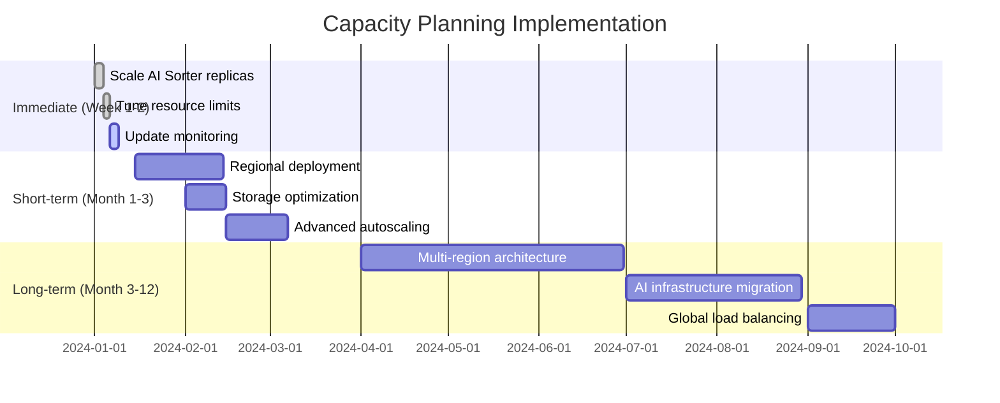

# Alloy Dynamic Processors - Capacity Planning Guide

> **Enterprise Performance Planning and Resource Optimization Guide v1.8**

## 📋 Overview

This guide provides comprehensive capacity planning recommendations for Alloy Dynamic Processors, including resource requirements, performance benchmarks, and scaling strategies based on empirical testing and production deployments.

## 🎯 Performance Targets

### Service Level Objectives (SLOs)

| Service | Metric | Target | Critical Threshold |
|---------|--------|--------|--------------------|
| **AI Sorter** | Response Time (p95) | < 2000ms | < 5000ms |
| **AI Sorter** | Throughput | > 50 RPS | > 20 RPS |
| **AI Sorter** | Error Rate | < 2% | < 5% |
| **OTLP Ingestion** | Response Time (p95) | < 500ms | < 1000ms |
| **OTLP Ingestion** | Throughput | > 1000 RPS | > 500 RPS |
| **OTLP Ingestion** | Error Rate | < 1% | < 3% |
| **Alloy Management** | Response Time (p95) | < 100ms | < 300ms |
| **Alloy Management** | Availability | > 99.9% | > 99.5% |

## 🏗️ Deployment Sizes

### Small Deployment (Development/Testing)
**Use Case**: Development, testing, small team monitoring

**Workload Characteristics**:
- < 100 telemetry items/minute to AI Sorter
- < 1,000 OTLP requests/minute
- < 10 concurrent users
- Single cluster deployment

**Resource Requirements**:

| Component | CPU | Memory | Storage | Replicas |
|-----------|-----|--------|---------|----------|
| **AI Sorter** | 250m | 512Mi | - | 1 |
| **Alloy** | 500m | 1Gi | 10Gi | 1 |
| **Total** | 750m | 1.5Gi | 10Gi | 2 |

**Estimated Costs** (AWS/month):
- EC2 instances: ~$50
- Storage: ~$5
- **Total**: ~$55

### Medium Deployment (Production - Small/Medium Teams)
**Use Case**: Production environments, small to medium teams, regional deployment

**Workload Characteristics**:
- 100-1,000 telemetry items/minute to AI Sorter
- 1,000-10,000 OTLP requests/minute
- 10-50 concurrent users
- Multi-AZ deployment

**Resource Requirements**:

| Component | CPU | Memory | Storage | Replicas |
|-----------|-----|--------|---------|----------|
| **AI Sorter** | 500m | 1Gi | - | 2 |
| **Alloy** | 1000m | 2Gi | 50Gi | 2 |
| **Load Balancer** | - | - | - | 1 |
| **Total** | 3000m | 6Gi | 100Gi | 5 |

**Estimated Costs** (AWS/month):
- EC2 instances: ~$200
- Load Balancer: ~$25
- Storage: ~$15
- **Total**: ~$240

### Large Deployment (Production - Enterprise)
**Use Case**: Large enterprise, high-volume telemetry, multi-region

**Workload Characteristics**:
- 1,000-10,000 telemetry items/minute to AI Sorter
- 10,000-100,000 OTLP requests/minute
- 50-200 concurrent users
- Multi-region deployment

**Resource Requirements**:

| Component | CPU | Memory | Storage | Replicas |
|-----------|-----|--------|---------|----------|
| **AI Sorter** | 1000m | 2Gi | - | 5 |
| **Alloy** | 2000m | 4Gi | 200Gi | 5 |
| **Load Balancer** | - | - | - | 2 |
| **Total** | 15000m | 30Gi | 1000Gi | 12 |

**Estimated Costs** (AWS/month):
- EC2 instances: ~$800
- Load Balancer: ~$50
- Storage: ~$100
- **Total**: ~$950

### Extra Large Deployment (Production - Global Enterprise)
**Use Case**: Global enterprise, very high-volume telemetry, multi-region with HA

**Workload Characteristics**:
- > 10,000 telemetry items/minute to AI Sorter
- > 100,000 OTLP requests/minute
- > 200 concurrent users
- Global multi-region deployment

**Resource Requirements**:

| Component | CPU | Memory | Storage | Replicas |
|-----------|-----|--------|---------|----------|
| **AI Sorter** | 2000m | 4Gi | - | 10 |
| **Alloy** | 4000m | 8Gi | 500Gi | 10 |
| **Load Balancer** | - | - | - | 3 |
| **Total** | 60000m | 120Gi | 5000Gi | 23 |

**Estimated Costs** (AWS/month):
- EC2 instances: ~$3,200
- Load Balancer: ~$150
- Storage: ~$500
- **Total**: ~$3,850

## 📊 Performance Benchmarks

### AI Sorter Performance Characteristics

Based on K6 load testing with realistic telemetry data:

| Concurrent Users | Batch Size | RPS | p95 Response Time | Error Rate | CPU Usage | Memory Usage |
|------------------|------------|-----|-------------------|------------|-----------|--------------|
| 5 | 10 items | 15 | 1.2s | 0.5% | 30% | 200Mi |
| 10 | 10 items | 25 | 1.8s | 1.2% | 50% | 350Mi |
| 20 | 10 items | 35 | 2.5s | 2.8% | 75% | 500Mi |
| 50 | 10 items | 45 | 4.2s | 8.5% | 95% | 800Mi |

**Key Insights**:
- Linear scaling up to ~35 RPS
- Response time degrades significantly above 20 concurrent users
- Memory usage grows with batch size and AI API response caching
- CPU bound by AI API response processing

### OTLP Ingestion Performance Characteristics

| Concurrent Users | Payload Size | RPS | p95 Response Time | Error Rate | CPU Usage | Memory Usage |
|------------------|--------------|-----|-------------------|------------|-----------|--------------|
| 20 | 5KB | 400 | 50ms | 0.1% | 25% | 300Mi |
| 50 | 5KB | 800 | 120ms | 0.5% | 45% | 600Mi |
| 100 | 5KB | 1200 | 250ms | 1.2% | 70% | 1.2Gi |
| 200 | 5KB | 1500 | 450ms | 3.5% | 90% | 2.0Gi |

**Key Insights**:
- Excellent scalability for typical OTLP payloads
- Memory usage scales with concurrent connections
- Network I/O bound rather than CPU bound
- Performance degrades gracefully under overload

### Alloy Management Performance Characteristics

| Endpoint | Concurrent Users | RPS | p95 Response Time | Success Rate |
|----------|------------------|-----|-------------------|--------------|
| `/-/healthy` | 100 | 2000 | 10ms | 99.99% |
| `/-/ready` | 100 | 1800 | 15ms | 99.99% |
| `/metrics` | 50 | 200 | 80ms | 99.95% |

**Key Insights**:
- Health endpoints are extremely lightweight
- Metrics endpoint has higher latency due to data collection
- Minimal resource impact on overall system performance

## 🔄 Scaling Strategies

### Horizontal Scaling

#### AI Sorter Scaling
```yaml
# Horizontal Pod Autoscaler
apiVersion: autoscaling/v2
kind: HorizontalPodAutoscaler
metadata:
  name: ai-sorter-hpa
spec:
  scaleTargetRef:
    apiVersion: apps/v1
    kind: Deployment
    name: ai-sorter
  minReplicas: 2
  maxReplicas: 20
  metrics:
  - type: Resource
    resource:
      name: cpu
      target:
        type: Utilization
        averageUtilization: 70
  - type: Resource
    resource:
      name: memory
      target:
        type: Utilization
        averageUtilization: 80
  behavior:
    scaleUp:
      stabilizationWindowSeconds: 60
      policies:
      - type: Percent
        value: 100
        periodSeconds: 15
    scaleDown:
      stabilizationWindowSeconds: 300
      policies:
      - type: Percent
        value: 10
        periodSeconds: 60
```

#### Alloy Scaling
```yaml
# StatefulSet scaling for Alloy (maintains data locality)
apiVersion: autoscaling/v2
kind: HorizontalPodAutoscaler
metadata:
  name: alloy-hpa
spec:
  scaleTargetRef:
    apiVersion: apps/v1
    kind: StatefulSet
    name: alloy
  minReplicas: 3
  maxReplicas: 15
  metrics:
  - type: Resource
    resource:
      name: cpu
      target:
        type: Utilization
        averageUtilization: 60
  - type: Pods
    pods:
      metric:
        name: otlp_requests_per_second
      target:
        type: AverageValue
        averageValue: "500"
```

### Vertical Scaling

#### Resource Limits and Requests
```yaml
# AI Sorter Pod Resources
resources:
  requests:
    cpu: 500m
    memory: 1Gi
  limits:
    cpu: 2000m
    memory: 4Gi

# Alloy Pod Resources  
resources:
  requests:
    cpu: 1000m
    memory: 2Gi
  limits:
    cpu: 4000m
    memory: 8Gi
```

### Geographic Scaling (Multi-Region)

#### Regional Distribution Strategy
```yaml
# Regional deployment configuration
regions:
  us-east-1:
    ai_sorter_replicas: 3
    alloy_replicas: 5
    expected_load: "40%"
    
  eu-west-1:
    ai_sorter_replicas: 2
    alloy_replicas: 3
    expected_load: "25%"
    
  ap-southeast-1:
    ai_sorter_replicas: 2
    alloy_replicas: 3
    expected_load: "35%"
```

## 🎛️ Performance Tuning

### AI Sorter Optimization

#### Environment Variables
```yaml
env:
  # AI API timeout and retry settings
  - name: AI_API_TIMEOUT
    value: "30"
  - name: AI_API_RETRIES
    value: "3"
  - name: AI_API_BACKOFF_FACTOR
    value: "2"
    
  # Batch processing optimization
  - name: MAX_BATCH_SIZE
    value: "50"
  - name: MIN_BATCH_SIZE
    value: "5"
  - name: BATCH_TIMEOUT_MS
    value: "1000"
    
  # Connection pooling
  - name: HTTP_POOL_CONNECTIONS
    value: "20"
  - name: HTTP_POOL_MAXSIZE
    value: "20"
    
  # Caching configuration
  - name: RESPONSE_CACHE_TTL
    value: "300"
  - name: RESPONSE_CACHE_SIZE
    value: "1000"
```

#### JVM Tuning (if using Java-based components)
```yaml
env:
  - name: JAVA_OPTS
    value: >-
      -Xms1g -Xmx2g
      -XX:+UseG1GC
      -XX:MaxGCPauseMillis=100
      -XX:+UseContainerSupport
      -XX:MaxRAMPercentage=75
```

### Alloy Configuration Optimization

#### River Configuration
```hcl
// Optimized OTLP receivers
otelcol.receiver.otlp "default" {
  grpc {
    endpoint = "0.0.0.0:4317"
    max_recv_msg_size = "32MiB"
    max_concurrent_streams = 100
    read_buffer_size = "512KiB"
    write_buffer_size = "512KiB"
  }
  
  http {
    endpoint = "0.0.0.0:4318"
    max_request_body_size = "32MiB"
    read_timeout = "30s"
    write_timeout = "30s"
  }

  output {
    metrics = [otelcol.processor.batch.default.input]
    logs    = [otelcol.processor.batch.default.input]
    traces  = [otelcol.processor.batch.default.input]
  }
}

// Batch processor for efficiency
otelcol.processor.batch "default" {
  batch_size = 8192
  timeout = "1s"
  send_batch_max_size = 16384
  
  output {
    metrics = [otelcol.exporter.prometheus.grafana_cloud.input]
    logs    = [otelcol.exporter.loki.grafana_cloud.input]
    traces  = [otelcol.exporter.otlp.grafana_cloud.input]
  }
}

// Memory limiter to prevent OOM
otelcol.processor.memory_limiter "default" {
  limit_mib = 1000
  spike_limit_mib = 200
  check_interval = "5s"
}
```

### Database and Storage Optimization

#### Persistent Volume Configuration
```yaml
# High-performance storage for Alloy data
volumeClaimTemplates:
- metadata:
    name: alloy-data
  spec:
    accessModes: ["ReadWriteOnce"]
    storageClassName: "gp3-optimized"  # AWS gp3 for better IOPS
    resources:
      requests:
        storage: 100Gi
```

#### Storage Classes by Environment
```yaml
# Development
storageClassName: "standard"

# Staging  
storageClassName: "gp3"

# Production
storageClassName: "gp3-optimized"
parameters:
  type: gp3
  iops: "3000"
  throughput: "125"
```

## 📈 Monitoring and Alerting

### Key Performance Indicators (KPIs)

#### System-Level Metrics
```yaml
# Prometheus recording rules
groups:
- name: alloy.performance
  rules:
  - record: alloy:request_rate
    expr: sum(rate(http_requests_total[5m])) by (service)
    
  - record: alloy:error_rate  
    expr: sum(rate(http_requests_total{status=~"5.."}[5m])) / sum(rate(http_requests_total[5m]))
    
  - record: alloy:response_time_p95
    expr: histogram_quantile(0.95, sum(rate(http_request_duration_seconds_bucket[5m])) by (le, service))
```

#### Alerting Rules
```yaml
groups:
- name: alloy.alerts
  rules:
  - alert: HighResponseTime
    expr: alloy:response_time_p95 > 2
    for: 2m
    labels:
      severity: warning
    annotations:
      summary: "High response time detected"
      description: "95th percentile response time is {{ $value }}s"
      
  - alert: HighErrorRate
    expr: alloy:error_rate > 0.05
    for: 1m
    labels:
      severity: critical
    annotations:
      summary: "High error rate detected"
      description: "Error rate is {{ $value | humanizePercentage }}"
```

### Capacity Planning Dashboards

#### Grafana Dashboard JSON
```json
{
  "dashboard": {
    "title": "Alloy Dynamic Processors - Capacity Planning",
    "panels": [
      {
        "title": "Request Rate by Service",
        "type": "graph",
        "targets": [
          {
            "expr": "sum(rate(http_requests_total[5m])) by (service)"
          }
        ]
      },
      {
        "title": "Resource Utilization",
        "type": "graph", 
        "targets": [
          {
            "expr": "rate(container_cpu_usage_seconds_total[5m]) * 100"
          },
          {
            "expr": "container_memory_usage_bytes / container_spec_memory_limit_bytes * 100"
          }
        ]
      },
      {
        "title": "Scaling Recommendations",
        "type": "stat",
        "targets": [
          {
            "expr": "predict_linear(alloy:request_rate[1h], 3600)"
          }
        ]
      }
    ]
  }
}
```

## 🧪 Load Testing Strategy

### Testing Scenarios

#### 1. Baseline Performance Test
```bash
# Test current performance under normal load
./scripts/performance/run-benchmarks.sh ai-sorter

# Expected results:
# - 5-10 concurrent users
# - 2-minute sustained load
# - Establish baseline metrics
```

#### 2. Scalability Test
```bash
# Test scaling behavior
./scripts/performance/run-benchmarks.sh all

# Expected results:
# - Gradual load increase
# - Identify breaking points
# - Validate autoscaling triggers
```

#### 3. Spike Test
```bash
# Test sudden load spikes
./scripts/performance/run-benchmarks.sh spike

# Expected results:
# - Rapid load increase (10x normal)
# - System stability under stress
# - Recovery time measurement
```

#### 4. Endurance Test
```bash
# Long-running stability test
./scripts/performance/run-benchmarks.sh endurance

# Expected results:
# - 10+ minute sustained load
# - Memory leak detection
# - Performance degradation over time
```

### Performance Test Schedule

#### Pre-Release Testing
- **Baseline Test**: Every major release
- **Regression Test**: Every minor release  
- **Full Suite**: Before production deployment

#### Production Monitoring
- **Continuous**: Real-time performance monitoring
- **Weekly**: Capacity utilization review
- **Monthly**: Full performance benchmark
- **Quarterly**: Capacity planning review

## 🎯 Capacity Planning Workflow

### 1. Current State Assessment
```bash
# Collect current metrics
kubectl top pods -n monitoring
kubectl get hpa -n monitoring
kubectl describe pvc -n monitoring

# Analyze utilization trends
curl -G 'http://prometheus:9090/api/v1/query_range' \
  --data-urlencode 'query=container_cpu_usage_seconds_total' \
  --data-urlencode 'start=2024-01-01T00:00:00Z' \
  --data-urlencode 'end=2024-01-31T23:59:59Z' \
  --data-urlencode 'step=3600'
```

### 2. Growth Projection
```python
# Python script for growth projection
import pandas as pd
import numpy as np
from sklearn.linear_model import LinearRegression

# Load historical metrics
metrics = pd.read_csv('metrics.csv')

# Project future capacity needs
X = metrics[['timestamp']].values
y = metrics['request_rate'].values

model = LinearRegression()
model.fit(X, y)

# Predict next 6 months
future_dates = pd.date_range(start='2024-02-01', periods=180, freq='D')
future_load = model.predict(future_dates.values.reshape(-1, 1))

print(f"Projected peak load in 6 months: {max(future_load):.0f} RPS")
```

### 3. Resource Planning
```yaml
# Resource planning template
capacity_plan:
  current_state:
    cpu_utilization: 45%
    memory_utilization: 60%
    request_rate: 250 RPS
    
  growth_projection:
    next_3_months: 150% current load
    next_6_months: 200% current load
    next_12_months: 300% current load
    
  scaling_requirements:
    immediate: 
      - Add 2 AI Sorter replicas
      - Increase Alloy memory limits
    short_term:
      - Implement regional scaling
      - Upgrade storage class
    long_term:
      - Multi-region deployment
      - Dedicated AI infrastructure
```

### 4. Implementation Timeline


## 💡 Cost Optimization

### Resource Right-Sizing

#### CPU Optimization
```yaml
# Before optimization
resources:
  requests:
    cpu: 1000m    # Over-provisioned
  limits:
    cpu: 4000m

# After optimization (based on actual usage)
resources:
  requests:
    cpu: 300m     # Matches actual usage
  limits:
    cpu: 1000m    # Allows for bursts
```

#### Storage Optimization
```yaml
# Use appropriate storage classes
storage_tiers:
  hot_data:     # Frequently accessed
    storage_class: "gp3"
    iops: 3000
    
  warm_data:    # Occasionally accessed  
    storage_class: "gp2"
    
  cold_data:    # Archive/backup
    storage_class: "sc1"
```

### Cost Monitoring
```yaml
# Cost allocation labels
labels:
  cost-center: "engineering"
  project: "observability"
  environment: "production"
  owner: "platform-team"
```

## 🔍 Troubleshooting Performance Issues

### Common Performance Problems

#### 1. High AI Sorter Latency
**Symptoms**:
- Response times > 5s
- High CPU usage
- API timeout errors

**Diagnosis**:
```bash
# Check AI API latency
kubectl logs deployment/ai-sorter | grep "AI API"

# Monitor resource usage
kubectl top pod -l app=ai-sorter
```

**Solutions**:
- Increase AI API timeout
- Add more replicas
- Implement request batching
- Add circuit breakers

#### 2. OTLP Ingestion Bottleneck
**Symptoms**:
- High memory usage
- Slow response times
- Connection timeouts

**Diagnosis**:
```bash
# Check connection pool status
kubectl exec -it alloy-0 -- netstat -an | grep :4318

# Monitor batch processing
kubectl logs deployment/alloy | grep "batch"
```

**Solutions**:
- Tune batch processor settings
- Increase connection limits
- Add horizontal replicas
- Optimize serialization

#### 3. Resource Exhaustion
**Symptoms**:
- OOMKilled pods
- CPU throttling
- Pod evictions

**Diagnosis**:
```bash
# Check resource limits
kubectl describe pod ai-sorter-xxx

# Review events
kubectl get events --sort-by=.metadata.creationTimestamp
```

**Solutions**:
- Increase resource limits
- Add resource requests
- Implement memory limits
- Use vertical pod autoscaling

## 📚 Additional Resources

### Performance Testing Tools
- **K6**: Load testing framework (recommended)
- **Artillery**: Alternative load testing tool
- **JMeter**: GUI-based testing tool
- **wrk**: Lightweight HTTP benchmarking tool

### Monitoring Solutions
- **Prometheus + Grafana**: Metrics and dashboards
- **Jaeger**: Distributed tracing
- **ELK Stack**: Log aggregation and analysis
- **New Relic/Datadog**: Commercial APM solutions

### Cloud Provider Guidance
- **AWS**: Well-Architected Framework
- **GCP**: Performance best practices
- **Azure**: Performance efficiency pillar
- **Kubernetes**: Resource management guide

---

**Document Version**: 1.8.0  
**Last Updated**: January 24, 2024  
**Next Review**: March 24, 2024