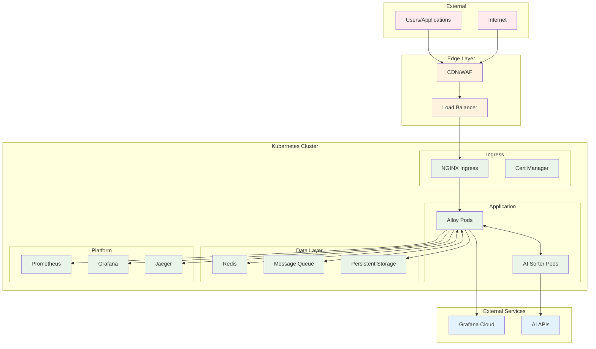
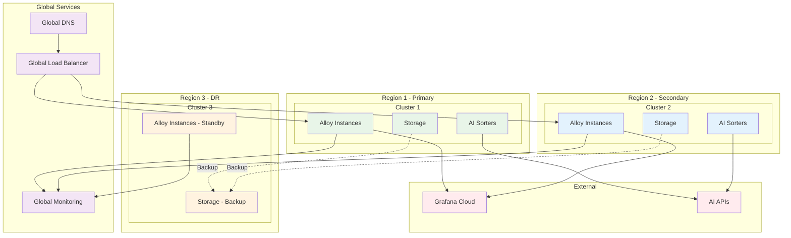

# Enterprise Deployment Guide

## Overview

This guide provides comprehensive deployment instructions for enterprise environments, covering single-cluster to multi-region deployments with high availability, security, and scalability considerations.

## Table of Contents

- [Prerequisites](#prerequisites)
- [Environment Planning](#environment-planning)
- [Single Cluster Deployment](#single-cluster-deployment)
- [Multi-Cluster Deployment](#multi-cluster-deployment)
- [Production Hardening](#production-hardening)
- [Monitoring and Observability](#monitoring-and-observability)
- [Disaster Recovery](#disaster-recovery)
- [Troubleshooting](#troubleshooting)

---

## Prerequisites

### Infrastructure Requirements

**Minimum Requirements:**
- Kubernetes 1.25+
- 3 worker nodes (4 CPU, 8GB RAM each)
- 100GB persistent storage
- Load balancer support
- DNS resolution

**Recommended Production:**
- Kubernetes 1.27+
- 6+ worker nodes (8 CPU, 16GB RAM each)
- 1TB+ persistent storage with backup
- Dedicated load balancer
- Service mesh (Istio/Linkerd)
- Container registry
- Monitoring stack

### Software Dependencies

```bash
# Required tools
kubectl >= 1.25
helm >= 3.10
docker >= 20.10

# Optional but recommended
istioctl >= 1.18
prometheus-operator
grafana-operator
cert-manager
vault (for secret management)
```

### Access Requirements

```yaml
# RBAC permissions needed
apiVersion: rbac.authorization.k8s.io/v1
kind: ClusterRole
metadata:
  name: alloy-deployment-admin
rules:
- apiGroups: [""]
  resources: ["*"]
  verbs: ["*"]
- apiGroups: ["apps", "extensions", "networking.k8s.io"]
  resources: ["*"]
  verbs: ["*"]
- apiGroups: ["monitoring.coreos.com"]
  resources: ["*"]
  verbs: ["*"]
```

---

## Environment Planning

### Environment Strategy

**Development Environment:**
```yaml
# values-development.yaml
replicaCount: 1
resources:
  limits:
    cpu: 500m
    memory: 1Gi
  requests:
    cpu: 250m
    memory: 512Mi

aiSorter:
  enabled: false  # Reduce complexity in dev

persistence:
  enabled: false  # Use ephemeral storage

autoscaling:
  enabled: false

networkPolicy:
  enabled: false  # Simplified networking
```

**Staging Environment:**
```yaml
# values-staging.yaml  
replicaCount: 2
resources:
  limits:
    cpu: 1000m
    memory: 2Gi
  requests:
    cpu: 500m
    memory: 1Gi

aiSorter:
  enabled: true
  replicaCount: 1

persistence:
  enabled: true
  size: 50Gi

autoscaling:
  enabled: true
  minReplicas: 2
  maxReplicas: 5

networkPolicy:
  enabled: true
```

**Production Environment:**
```yaml
# values-production.yaml
replicaCount: 3
resources:
  limits:
    cpu: 2000m
    memory: 4Gi
  requests:
    cpu: 1000m
    memory: 2Gi

aiSorter:
  enabled: true
  replicaCount: 2
  resources:
    limits:
      cpu: 1000m
      memory: 2Gi

persistence:
  enabled: true
  size: 200Gi
  storageClass: "fast-ssd"

autoscaling:
  enabled: true
  minReplicas: 3
  maxReplicas: 20

networkPolicy:
  enabled: true

podDisruptionBudget:
  enabled: true
  minAvailable: 2

security:
  podSecurityStandards: "restricted"
  networkPolicies: true
  rbac: true
```

### Network Architecture



---

## Single Cluster Deployment

### Step 1: Cluster Preparation

```bash
# Create namespace
kubectl create namespace alloy-system

# Label namespace for pod security standards
kubectl label namespace alloy-system \
  pod-security.kubernetes.io/enforce=restricted \
  pod-security.kubernetes.io/audit=restricted \
  pod-security.kubernetes.io/warn=restricted

# Create service account
kubectl create serviceaccount alloy-service-account -n alloy-system
```

### Step 2: Secret Management

```bash
# Create secrets for external services
kubectl create secret generic grafana-cloud-credentials \
  --from-literal=instance-id="YOUR_INSTANCE_ID" \
  --from-literal=api-key="YOUR_API_KEY" \
  -n alloy-system

kubectl create secret generic ai-sorter-secrets \
  --from-literal=grok-api-key="YOUR_GROK_API_KEY" \
  --from-literal=openai-api-key="YOUR_OPENAI_API_KEY" \
  -n alloy-system

# Label secrets for rotation tracking
kubectl label secret grafana-cloud-credentials \
  rotation-policy="30d" \
  -n alloy-system
```

### Step 3: Storage Setup

```bash
# Create storage class for high-performance storage
cat <<EOF | kubectl apply -f -
apiVersion: storage.k8s.io/v1
kind: StorageClass
metadata:
  name: alloy-fast-ssd
provisioner: kubernetes.io/gce-pd
parameters:
  type: pd-ssd
  replication-type: regional-pd
allowVolumeExpansion: true
volumeBindingMode: WaitForFirstConsumer
EOF

# Create persistent volume claim
cat <<EOF | kubectl apply -f -
apiVersion: v1
kind: PersistentVolumeClaim
metadata:
  name: alloy-data
  namespace: alloy-system
spec:
  accessModes:
    - ReadWriteOnce
  storageClassName: alloy-fast-ssd
  resources:
    requests:
      storage: 200Gi
EOF
```

### Step 4: Deploy with Helm

```bash
# Add Helm repository (if external)
helm repo add alloy-dynamic-processors https://charts.example.com/alloy
helm repo update

# Deploy with production values
helm install alloy-prod ./helm/alloy-dynamic-processors \
  --namespace alloy-system \
  --values values-production.yaml \
  --set grafanaCloud.credentials.existingSecret=grafana-cloud-credentials \
  --set aiSorter.secretName=ai-sorter-secrets \
  --timeout 600s \
  --wait

# Verify deployment
kubectl get pods -n alloy-system
kubectl get services -n alloy-system
kubectl get ingress -n alloy-system
```

### Step 5: Post-Deployment Configuration

```bash
# Apply network policies
kubectl apply -f - <<EOF
apiVersion: networking.k8s.io/v1
kind: NetworkPolicy
metadata:
  name: alloy-network-policy
  namespace: alloy-system
spec:
  podSelector:
    matchLabels:
      app.kubernetes.io/name: alloy-dynamic-processors
  policyTypes:
  - Ingress
  - Egress
  ingress:
  - from:
    - namespaceSelector:
        matchLabels:
          name: ingress-system
    ports:
    - protocol: TCP
      port: 4317
    - protocol: TCP
      port: 4318
  - from:
    - podSelector:
        matchLabels:
          app.kubernetes.io/name: ai-sorter
    ports:
    - protocol: TCP
      port: 8000
  egress:
  - to: []
    ports:
    - protocol: TCP
      port: 443
    - protocol: TCP
      port: 53
    - protocol: UDP
      port: 53
EOF

# Configure monitoring
kubectl apply -f - <<EOF
apiVersion: monitoring.coreos.com/v1
kind: ServiceMonitor
metadata:
  name: alloy-service-monitor
  namespace: alloy-system
spec:
  selector:
    matchLabels:
      app.kubernetes.io/name: alloy-dynamic-processors
  endpoints:
  - port: metrics
    interval: 30s
    path: /metrics
EOF
```

---

## Multi-Cluster Deployment

### Architecture Overview



### Step 1: Cluster Federation Setup

```bash
# Install cluster federation tools
kubectl apply -f https://github.com/kubernetes-sigs/cluster-api/releases/latest/download/cluster-api-components.yaml

# Register clusters
for cluster in cluster-1 cluster-2 cluster-3; do
  kubectl config use-context $cluster
  kubectl apply -f - <<EOF
apiVersion: v1
kind: ConfigMap
metadata:
  name: cluster-info
  namespace: kube-system
data:
  cluster-name: $cluster
  region: $(kubectl get nodes -o jsonpath='{.items[0].metadata.labels.topology\.kubernetes\.io/region}')
EOF
done
```

### Step 2: Global Load Balancing

```yaml
# Global load balancer configuration
apiVersion: networking.gke.io/v1
kind: ManagedCertificate
metadata:
  name: alloy-global-cert
spec:
  domains:
    - alloy.yourdomain.com
    - api.alloy.yourdomain.com

---
apiVersion: networking.k8s.io/v1
kind: Ingress
metadata:
  name: alloy-global-ingress
  annotations:
    kubernetes.io/ingress.global-static-ip-name: "alloy-global-ip"
    networking.gke.io/managed-certificates: "alloy-global-cert"
    kubernetes.io/ingress.class: "gce"
spec:
  rules:
  - host: alloy.yourdomain.com
    http:
      paths:
      - path: /*
        pathType: ImplementationSpecific
        backend:
          service:
            name: alloy-service
            port:
              number: 80
```

### Step 3: Cross-Cluster Service Discovery

```bash
# Deploy Consul for service discovery
helm install consul hashicorp/consul \
  --set global.datacenter=dc1 \
  --set global.federation.enabled=true \
  --set meshGateway.enabled=true \
  --set connectInject.enabled=true

# Configure cross-cluster communication
kubectl apply -f - <<EOF
apiVersion: v1
kind: Service
metadata:
  name: alloy-cross-cluster
  annotations:
    consul.hashicorp.com/service-sync: "true"
spec:
  selector:
    app.kubernetes.io/name: alloy-dynamic-processors
  ports:
  - port: 4317
    name: otlp-grpc
  - port: 4318
    name: otlp-http
  type: LoadBalancer
EOF
```

---

## Production Hardening

### Security Hardening

```bash
# Apply Pod Security Standards
kubectl apply -f - <<EOF
apiVersion: v1
kind: Namespace
metadata:
  name: alloy-system
  labels:
    pod-security.kubernetes.io/enforce: restricted
    pod-security.kubernetes.io/audit: restricted
    pod-security.kubernetes.io/warn: restricted
EOF

# Deploy network policies
kubectl apply -f - <<EOF
apiVersion: networking.k8s.io/v1
kind: NetworkPolicy
metadata:
  name: deny-all
  namespace: alloy-system
spec:
  podSelector: {}
  policyTypes:
  - Ingress
  - Egress

---
apiVersion: networking.k8s.io/v1
kind: NetworkPolicy
metadata:
  name: allow-alloy-communication
  namespace: alloy-system
spec:
  podSelector:
    matchLabels:
      app.kubernetes.io/name: alloy-dynamic-processors
  policyTypes:
  - Ingress
  - Egress
  ingress:
  - from:
    - podSelector:
        matchLabels:
          app.kubernetes.io/name: ai-sorter
  - from:
    - namespaceSelector:
        matchLabels:
          name: ingress-system
    ports:
    - protocol: TCP
      port: 4317
    - protocol: TCP
      port: 4318
  egress:
  - to: []
    ports:
    - protocol: TCP
      port: 443  # HTTPS outbound
    - protocol: TCP
      port: 53   # DNS
    - protocol: UDP
      port: 53   # DNS
EOF
```

### Resource Limits and Quotas

```yaml
# Namespace resource quota
apiVersion: v1
kind: ResourceQuota
metadata:
  name: alloy-quota
  namespace: alloy-system
spec:
  hard:
    requests.cpu: "20"
    requests.memory: 40Gi
    limits.cpu: "40"
    limits.memory: 80Gi
    persistentvolumeclaims: "10"
    services.loadbalancers: "2"

---
# Limit ranges
apiVersion: v1
kind: LimitRange
metadata:
  name: alloy-limits
  namespace: alloy-system
spec:
  limits:
  - default:
      cpu: 1000m
      memory: 2Gi
    defaultRequest:
      cpu: 500m
      memory: 1Gi
    type: Container
  - max:
      storage: 1Ti
    min:
      storage: 1Gi
    type: PersistentVolumeClaim
```

### High Availability Configuration

```yaml
# Pod Disruption Budget
apiVersion: policy/v1
kind: PodDisruptionBudget
metadata:
  name: alloy-pdb
  namespace: alloy-system
spec:
  minAvailable: 2
  selector:
    matchLabels:
      app.kubernetes.io/name: alloy-dynamic-processors

---
# Anti-affinity rules
apiVersion: apps/v1
kind: Deployment
metadata:
  name: alloy-dynamic-processors
spec:
  template:
    spec:
      affinity:
        podAntiAffinity:
          requiredDuringSchedulingIgnoredDuringExecution:
          - labelSelector:
              matchLabels:
                app.kubernetes.io/name: alloy-dynamic-processors
            topologyKey: kubernetes.io/hostname
        nodeAffinity:
          requiredDuringSchedulingIgnoredDuringExecution:
            nodeSelectorTerms:
            - matchExpressions:
              - key: node-role.kubernetes.io/worker
                operator: In
                values: ["true"]
```

---

## Monitoring and Observability

### Prometheus Configuration

```yaml
# Prometheus rules for Alloy monitoring
apiVersion: monitoring.coreos.com/v1
kind: PrometheusRule
metadata:
  name: alloy-monitoring-rules
  namespace: alloy-system
spec:
  groups:
  - name: alloy.rules
    rules:
    - alert: AlloyInstanceDown
      expr: up{job="alloy-dynamic-processors"} == 0
      for: 1m
      labels:
        severity: critical
      annotations:
        summary: "Alloy instance is down"
        description: "Alloy instance {{ $labels.instance }} has been down for more than 1 minute"
        
    - alert: AlloyHighMemoryUsage
      expr: (container_memory_usage_bytes{pod=~"alloy-.*"} / container_spec_memory_limit_bytes) > 0.8
      for: 5m
      labels:
        severity: warning
      annotations:
        summary: "High memory usage in Alloy"
        description: "Memory usage is above 80% for {{ $labels.pod }}"
        
    - alert: AlloyProcessingLatencyHigh
      expr: histogram_quantile(0.95, rate(alloy_processing_duration_seconds_bucket[5m])) > 0.1
      for: 2m
      labels:
        severity: warning
      annotations:
        summary: "High processing latency"
        description: "95th percentile latency is {{ $value }}s"

    - alert: AIClassificationFailureRate
      expr: rate(ai_classification_errors_total[5m]) / rate(ai_classification_requests_total[5m]) > 0.1
      for: 1m
      labels:
        severity: critical
      annotations:
        summary: "High AI classification failure rate"
        description: "AI classification failure rate is {{ $value | humanizePercentage }}"
```

### Grafana Dashboards

```json
{
  "dashboard": {
    "title": "Alloy Dynamic Processors - Enterprise Dashboard",
    "panels": [
      {
        "title": "Processing Rate",
        "type": "stat",
        "targets": [
          {
            "expr": "sum(rate(alloy_processed_total[5m]))",
            "legendFormat": "Events/sec"
          }
        ]
      },
      {
        "title": "AI Classification Accuracy",
        "type": "gauge",
        "targets": [
          {
            "expr": "sum(ai_classification_success_total) / sum(ai_classification_total) * 100",
            "legendFormat": "Accuracy %"
          }
        ]
      },
      {
        "title": "Resource Utilization",
        "type": "timeseries",
        "targets": [
          {
            "expr": "avg(rate(container_cpu_usage_seconds_total{pod=~\"alloy-.*\"}[5m]))",
            "legendFormat": "CPU Usage"
          },
          {
            "expr": "avg(container_memory_usage_bytes{pod=~\"alloy-.*\"}) / 1024 / 1024 / 1024",
            "legendFormat": "Memory Usage (GB)"
          }
        ]
      }
    ]
  }
}
```

### Distributed Tracing

```yaml
# Jaeger deployment
apiVersion: jaegertracing.io/v1
kind: Jaeger
metadata:
  name: alloy-tracing
  namespace: alloy-system
spec:
  strategy: production
  storage:
    type: elasticsearch
    elasticsearch:
      nodeCount: 3
      storage:
        size: 100Gi
        storageClassName: fast-ssd
  collector:
    maxReplicas: 5
    resources:
      limits:
        cpu: 500m
        memory: 1Gi
  query:
    replicas: 2
    resources:
      limits:
        cpu: 200m
        memory: 512Mi
```

---

## Disaster Recovery

### Backup Strategy

```bash
# Create backup script
cat > backup-alloy.sh << 'EOF'
#!/bin/bash
set -e

BACKUP_DATE=$(date +%Y%m%d-%H%M%S)
BACKUP_DIR="/backups/alloy-${BACKUP_DATE}"
NAMESPACE="alloy-system"

# Create backup directory
mkdir -p "${BACKUP_DIR}"

# Backup Kubernetes resources
kubectl get -n ${NAMESPACE} -o yaml \
  deployments,services,configmaps,secrets,persistentvolumeclaims \
  > "${BACKUP_DIR}/k8s-resources.yaml"

# Backup Helm values
helm get values alloy-prod -n ${NAMESPACE} > "${BACKUP_DIR}/helm-values.yaml"

# Backup persistent data
kubectl exec -n ${NAMESPACE} deployment/alloy-dynamic-processors -- \
  tar czf - /data | tee "${BACKUP_DIR}/persistent-data.tgz" > /dev/null

# Create backup manifest
cat > "${BACKUP_DIR}/backup.json" << EOL
{
  "timestamp": "${BACKUP_DATE}",
  "namespace": "${NAMESPACE}",
  "helm_release": "alloy-prod",
  "files": [
    "k8s-resources.yaml",
    "helm-values.yaml", 
    "persistent-data.tgz"
  ]
}
EOL

echo "Backup completed: ${BACKUP_DIR}"
EOF

chmod +x backup-alloy.sh

# Schedule daily backups
kubectl apply -f - <<EOF
apiVersion: batch/v1
kind: CronJob
metadata:
  name: alloy-backup
  namespace: alloy-system
spec:
  schedule: "0 2 * * *"  # Daily at 2 AM
  jobTemplate:
    spec:
      template:
        spec:
          containers:
          - name: backup
            image: bitnami/kubectl:latest
            command: ["/bin/bash", "/scripts/backup-alloy.sh"]
            volumeMounts:
            - name: backup-script
              mountPath: /scripts
            - name: backup-storage
              mountPath: /backups
          volumes:
          - name: backup-script
            configMap:
              name: backup-script
              defaultMode: 0755
          - name: backup-storage
            persistentVolumeClaim:
              claimName: backup-storage
          restartPolicy: OnFailure
EOF
```

### Recovery Procedures

```bash
# Create recovery script
cat > recover-alloy.sh << 'EOF'
#!/bin/bash
set -e

BACKUP_DIR="$1"
if [ -z "$BACKUP_DIR" ]; then
  echo "Usage: $0 <backup-directory>"
  exit 1
fi

NAMESPACE="alloy-system"

echo "Starting recovery from ${BACKUP_DIR}"

# Restore namespace
kubectl create namespace ${NAMESPACE} --dry-run=client -o yaml | kubectl apply -f -

# Restore Kubernetes resources
kubectl apply -f "${BACKUP_DIR}/k8s-resources.yaml"

# Wait for persistent volume claims
kubectl wait --for=condition=Bound pvc --all -n ${NAMESPACE} --timeout=300s

# Restore persistent data
kubectl exec -n ${NAMESPACE} deployment/alloy-dynamic-processors -- \
  tar xzf - -C / < "${BACKUP_DIR}/persistent-data.tgz"

# Restore Helm release
helm upgrade --install alloy-prod ./helm/alloy-dynamic-processors \
  --namespace ${NAMESPACE} \
  --values "${BACKUP_DIR}/helm-values.yaml" \
  --wait

echo "Recovery completed successfully"
EOF

chmod +x recover-alloy.sh
```

---

## Troubleshooting

### Common Issues and Solutions

**Issue: Pods stuck in Pending state**
```bash
# Check resource availability
kubectl describe nodes
kubectl get events -n alloy-system --sort-by='.lastTimestamp'

# Check storage
kubectl get pv,pvc -n alloy-system
kubectl describe pvc -n alloy-system

# Solution: Scale up cluster or adjust resource requests
```

**Issue: AI Sorter connection failures**
```bash
# Check AI Sorter pod logs
kubectl logs -n alloy-system deployment/ai-sorter --tail=100

# Check network connectivity
kubectl exec -n alloy-system deployment/alloy-dynamic-processors -- \
  curl -v http://ai-sorter:8000/health

# Check secrets
kubectl get secret ai-sorter-secrets -n alloy-system -o yaml
```

**Issue: High memory usage**
```bash
# Check memory metrics
kubectl top pods -n alloy-system

# Adjust memory limits
helm upgrade alloy-prod ./helm/alloy-dynamic-processors \
  --namespace alloy-system \
  --set resources.limits.memory=4Gi \
  --reuse-values
```

### Debug Commands

```bash
# Comprehensive cluster state check
kubectl get all,pv,pvc,ingress,networkpolicy -n alloy-system

# Check service mesh (if using Istio)
istioctl proxy-status
istioctl proxy-config cluster deployment/alloy-dynamic-processors -n alloy-system

# Performance analysis
kubectl exec -n alloy-system deployment/alloy-dynamic-processors -- \
  curl -s localhost:8889/metrics | grep -E "(cpu|memory|processing)"

# Network troubleshooting
kubectl exec -n alloy-system deployment/alloy-dynamic-processors -- \
  netstat -tuln

# Configuration validation
helm template alloy-prod ./helm/alloy-dynamic-processors \
  --namespace alloy-system \
  --values values-production.yaml | kubectl apply --dry-run=client -f -
```

### Performance Tuning

```bash
# Scale horizontally
kubectl scale deployment alloy-dynamic-processors \
  --replicas=5 -n alloy-system

# Adjust HPA settings
kubectl patch hpa alloy-hpa -n alloy-system -p '{"spec":{"targetCPUUtilizationPercentage":60}}'

# Update resource limits
helm upgrade alloy-prod ./helm/alloy-dynamic-processors \
  --namespace alloy-system \
  --set resources.limits.cpu=2000m \
  --set resources.limits.memory=4Gi \
  --reuse-values

# Enable performance profiling
helm upgrade alloy-prod ./helm/alloy-dynamic-processors \
  --namespace alloy-system \
  --set debug.profiling.enabled=true \
  --reuse-values
```

---

*This deployment guide covers enterprise-grade deployment scenarios. For specific cloud provider instructions, refer to the provider-specific documentation in the respective subdirectories.*