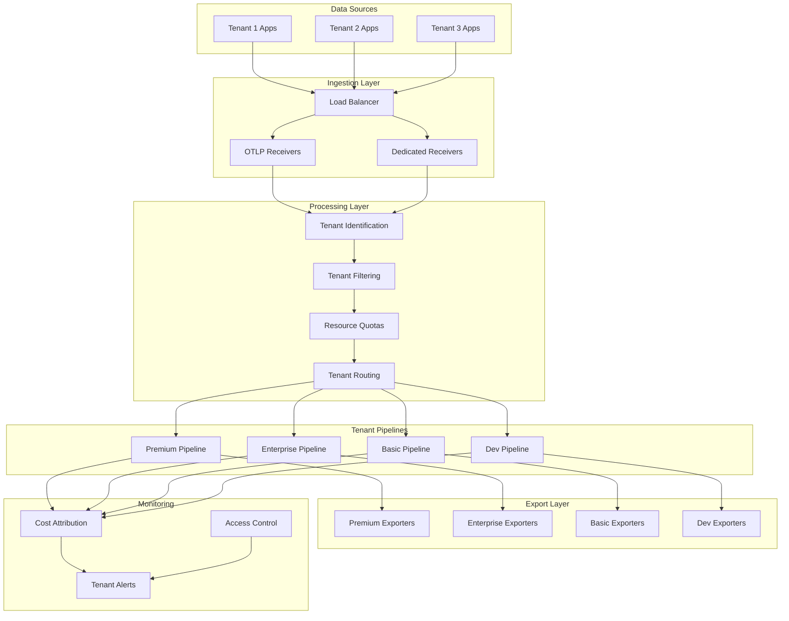

# Multi-Tenant Configuration Framework Guide

## Overview

The Multi-Tenant Configuration Framework provides enterprise-grade tenant isolation, resource quotas, RBAC, and cost attribution for Grafana Alloy observability deployments. This framework enables organizations to serve multiple customers or business units with guaranteed resource isolation and granular cost tracking.

## Table of Contents

- [Architecture Overview](#architecture-overview)
- [Tenant Tiers](#tenant-tiers)
- [Configuration Guide](#configuration-guide)
- [Deployment Examples](#deployment-examples)
- [Cost Attribution](#cost-attribution)
- [Security & RBAC](#security--rbac)
- [Monitoring & Alerting](#monitoring--alerting)
- [Troubleshooting](#troubleshooting)
- [Best Practices](#best-practices)

## Architecture Overview

### Multi-Tenant Processing Flow



### Key Components

1. **Tenant Identification**: Automatically identifies tenant from various sources (headers, attributes, namespaces)
2. **Resource Quotas**: Enforces memory, CPU, and throughput limits per tenant
3. **Tenant Routing**: Routes telemetry data through tenant-specific processing pipelines
4. **Cost Attribution**: Tracks resource consumption and costs per tenant
5. **RBAC Integration**: Provides fine-grained access control per tenant
6. **Network Isolation**: Optional network policies for tenant isolation

## Tenant Tiers

### Premium Tier
- **Use Case**: High-value customers requiring guaranteed SLA
- **Resources**: Dedicated receivers, high memory limits, low latency
- **Features**: Custom dashboards, dedicated support, premium endpoints
- **Cost**: Highest per-datapoint cost, dedicated infrastructure

**Characteristics:**
- Memory Limit: 2-4 GB
- Batch Timeout: 3-5 seconds
- Retention: 90-365 days
- SLA: 99.99% availability, <100ms latency
- Dedicated receiver ports

### Enterprise Tier
- **Use Case**: Large organizations with moderate SLA requirements
- **Resources**: Shared receivers, balanced performance
- **Features**: Custom alerting, moderate retention
- **Cost**: Moderate per-datapoint cost

**Characteristics:**
- Memory Limit: 1-2 GB
- Batch Timeout: 7-10 seconds
- Retention: 60-90 days
- SLA: 99.9% availability, <250ms latency
- Shared infrastructure with priority

### Basic Tier
- **Use Case**: Small to medium businesses, cost-conscious
- **Resources**: Shared infrastructure, standard performance
- **Features**: Basic monitoring, limited alerting
- **Cost**: Low per-datapoint cost

**Characteristics:**
- Memory Limit: 512 MB - 1 GB
- Batch Timeout: 20-30 seconds
- Retention: 30 days
- SLA: 99.5% availability, <1000ms latency
- Cost-optimized processing

### Development Tier
- **Use Case**: Development, testing, and staging environments
- **Resources**: Minimal resources, relaxed SLA
- **Features**: Basic functionality, no alerting
- **Cost**: Minimal cost, internal billing

**Characteristics:**
- Memory Limit: 256 MB
- Batch Timeout: 60 seconds
- Retention: 7 days
- SLA: 95% availability, <5000ms latency
- Development-focused features

## Configuration Guide

### Enabling Multi-Tenant Mode

1. **Update Helm Values**:
```yaml
# Enable multi-tenant configuration
alloy:
  config:
    type: "multi-tenant"

multiTenant:
  enabled: true
```

2. **Configure Global Settings**:
```yaml
multiTenant:
  global:
    region: "us-west-2"
    processingRegion: "us-west-2"
    instanceType: "c5.4xlarge"
    
    defaultQuotas:
      memoryLimitMib: 1024
      spikeLimitMib: 256
      maxConcurrentStreams: 100
      batchSize: 1024
      batchTimeout: "15s"
      retentionDays: 30
```

### Defining Tenants

```yaml
multiTenant:
  tenants:
  - id: "customer-premium-1"
    name: "Premium Customer 1"
    tier: "premium"
    organization: "acme-corp"
    
    # Resource quotas
    quotas:
      memoryLimitMib: 4096
      spikeLimitMib: 1024
      maxConcurrentStreams: 500
      batchSize: 4096
      batchTimeout: "3s"
      retentionDays: 365
    
    # Cost attribution
    costCenter:
      id: "premium-cc-001"
      department: "platform"
      project: "observability"
      billingAccount: "premium-billing"
    
    # RBAC configuration
    rbac:
      enabled: true
      users:
      - name: "admin@acme-corp.com"
      - name: "ops@acme-corp.com"
      groups:
      - name: "acme-platform-team"
    
    # Routing configuration
    routing:
      dedicatedReceiver:
        enabled: true
        grpcPort: 4327
        httpPort: 4328
      
      exporters:
        tempo:
          endpoint: "https://tempo-premium.grafana.net:443"
          auth:
            secretName: "premium-auth"
            usernameKey: "username"
            passwordKey: "password"
    
    # SLA targets
    sla:
      targetLatencyMs: 50
      targetAvailability: 99.99
      targetThroughputRps: 50000
```

### Tenant Identification Methods

The framework supports multiple tenant identification methods:

1. **HTTP Headers**:
```bash
curl -X POST http://alloy:4318/v1/traces \
  -H "X-Tenant-ID: customer-premium-1" \
  -H "Content-Type: application/json" \
  -d @traces.json
```

2. **gRPC Metadata**:
```go
ctx := metadata.AppendToOutgoingContext(ctx, "tenant_id", "customer-premium-1")
```

3. **Resource Attributes**:
```yaml
# In your application's telemetry configuration
resource:
  attributes:
    tenant.id: "customer-premium-1"
    tenant.tier: "premium"
```

4. **Kubernetes Namespace**:
```yaml
# Alloy automatically detects tenant from namespace
metadata:
  namespace: "tenant-premium-1"
```

## Deployment Examples

### Basic Multi-Tenant Deployment

```bash
# Deploy with multi-tenant support
helm install alloy-mt ./alloy/helm/alloy-dynamic-processors \
  --namespace observability \
  --values ./alloy/helm/alloy-dynamic-processors/examples/values-multi-tenant.yaml
```

### Premium Tenant with Dedicated Resources

```yaml
# Create dedicated namespace
apiVersion: v1
kind: Namespace
metadata:
  name: tenant-premium-acme
  labels:
    tenant.id: "acme-premium"
    tenant.tier: "premium"

---
# Create tenant-specific secret
apiVersion: v1
kind: Secret
metadata:
  name: acme-premium-auth
  namespace: tenant-premium-acme
type: Opaque
data:
  username: <base64-encoded-username>
  password: <base64-encoded-password>
```

### Cost-Optimized Basic Tenant

```yaml
multiTenant:
  tenants:
  - id: "startup-basic"
    tier: "basic"
    quotas:
      memoryLimitMib: 512
      batchTimeout: "30s"
      retentionDays: 30
    
    # Shared endpoints for cost optimization
    routing:
      exporters:
        tempo:
          endpoint: "https://tempo-shared.grafana.net:443"
    
    # Minimal monitoring
    monitoring:
      enabled: true
      alerting:
        enabled: false
```

## Cost Attribution

### Cost Tracking Metrics

The framework automatically tracks these cost metrics per tenant:

1. **Processing Costs**:
   - CPU usage per tenant
   - Memory consumption
   - Network egress
   - Storage utilization

2. **Data Volume Metrics**:
   - Metrics points processed
   - Log records processed
   - Trace spans processed
   - Data bytes processed

3. **Efficiency Metrics**:
   - Data processing efficiency
   - Resource utilization
   - SLA compliance

### Cost Calculation

```promql
# Total processing cost per tenant (5-minute rate)
tenant:alloy_total_processing_cost:rate5m =
  tenant:alloy_processing_cost_cpu:rate5m +
  tenant:alloy_processing_cost_memory:rate5m +
  tenant:alloy_network_cost:rate5m +
  tenant:alloy_storage_cost:current

# Cost per data point
tenant:alloy_cost_per_datapoint:rate5m =
  tenant:alloy_total_processing_cost:rate5m /
  (rate(metrics_processed[5m]) + rate(logs_processed[5m]) + rate(traces_processed[5m]))
```

### Cost Attribution Dashboard

The framework includes a pre-built Grafana dashboard showing:

- Cost breakdown per tenant
- Resource utilization trends
- Efficiency rankings
- Quota utilization
- Monthly cost projections

Access the dashboard at: `http://grafana/d/tenant-cost-attribution`

## Security & RBAC

### Tenant Isolation Levels

1. **Soft Isolation** (Default):
   - Logical separation via attributes
   - Shared infrastructure
   - Policy-based routing

2. **Network Isolation**:
   - Kubernetes Network Policies
   - Ingress/egress controls
   - Pod-to-pod restrictions

3. **Namespace Isolation**:
   - Dedicated namespaces per tenant
   - Resource quotas per namespace
   - RBAC per namespace

4. **Hard Isolation**:
   - Dedicated clusters per tier
   - Physical resource separation
   - Complete network isolation

### RBAC Configuration

```yaml
# Tenant-specific RBAC
rbac:
  enabled: true
  users:
  - name: "tenant-admin@company.com"
    permissions: ["read", "write", "admin"]
  - name: "tenant-viewer@company.com"
    permissions: ["read"]
  
  groups:
  - name: "tenant-operators"
    permissions: ["read", "write"]
  
  serviceAccounts:
  - name: "tenant-workload-sa"
    namespace: "tenant-apps"
    permissions: ["write"]
```

### Security Best Practices

1. **Authentication**:
   - Use separate credentials per tenant
   - Rotate secrets regularly
   - Enable audit logging

2. **Authorization**:
   - Implement least-privilege access
   - Use namespace-based RBAC
   - Regular access reviews

3. **Network Security**:
   - Enable network policies
   - Restrict egress traffic
   - Use TLS for all connections

4. **Data Protection**:
   - Encrypt data in transit
   - Secure credential storage
   - Implement data retention policies

## Monitoring & Alerting

### Tenant-Specific Alerts

```yaml
# High cost alert
- alert: TenantHighProcessingCost
  expr: tenant:alloy_total_processing_cost:rate5m > 5.0
  for: 5m
  labels:
    severity: warning
    tenant_id: "{{ $labels.tenant_id }}"
  annotations:
    summary: "High processing costs for tenant {{ $labels.tenant_id }}"

# Quota exceeded alert
- alert: TenantQuotaExceeded
  expr: tenant:alloy_quota_utilization:current > 95
  for: 2m
  labels:
    severity: critical
    tenant_id: "{{ $labels.tenant_id }}"
  annotations:
    summary: "Tenant {{ $labels.tenant_id }} approaching quota limit"

# SLA violation alert
- alert: TenantSLAViolation
  expr: tenant:alloy_sla_latency_compliance:rate5m < 95
  for: 10m
  labels:
    severity: warning
    tenant_id: "{{ $labels.tenant_id }}"
  annotations:
    summary: "SLA violation for tenant {{ $labels.tenant_id }}"
```

### Monitoring Dashboards

1. **Tenant Overview Dashboard**:
   - Resource utilization per tenant
   - Data volume trends
   - SLA compliance metrics
   - Cost attribution

2. **Tenant Performance Dashboard**:
   - Latency percentiles
   - Throughput metrics
   - Error rates
   - Resource efficiency

3. **Tenant Cost Dashboard**:
   - Cost breakdown by resource type
   - Historical cost trends
   - Cost efficiency rankings
   - Budget tracking

## Troubleshooting

### Common Issues

1. **Tenant Not Identified**:
```bash
# Check if tenant ID is being set correctly
kubectl logs -n observability alloy-pod | grep "tenant.id"

# Verify tenant configuration
kubectl get configmap alloy-tenant-config -o yaml
```

2. **Quota Exceeded**:
```bash
# Check quota utilization
kubectl top pods -n observability
kubectl describe pod alloy-pod | grep -A 10 "Resource Limits"
```

3. **Cost Attribution Missing**:
```bash
# Verify cost metrics are being collected
curl http://alloy:8889/metrics | grep tenant_cost
```

4. **RBAC Issues**:
```bash
# Check tenant permissions
kubectl auth can-i --list --as=system:serviceaccount:tenant-ns:tenant-sa
```

### Debugging Commands

```bash
# View tenant configurations
kubectl get configmaps -l app.kubernetes.io/component=tenant-config

# Check tenant routing
curl http://alloy:55679/debug/pipelinez

# Monitor tenant metrics
curl -s http://alloy:8889/metrics | grep -E "tenant_id|tenant_tier"

# Verify network policies (if enabled)
kubectl get networkpolicy -A
```

## Best Practices

### Tenant Design

1. **Tier Classification**:
   - Align tiers with business value
   - Consider SLA requirements
   - Plan for growth and scaling

2. **Resource Planning**:
   - Monitor usage patterns
   - Set appropriate quotas
   - Plan capacity for peak loads

3. **Cost Management**:
   - Regular cost reviews
   - Optimize resource allocation
   - Implement cost alerts

### Operational Excellence

1. **Monitoring**:
   - Implement comprehensive dashboards
   - Set up proactive alerts
   - Regular SLA reviews

2. **Security**:
   - Regular security audits
   - Credential rotation
   - Access reviews

3. **Performance**:
   - Regular performance testing
   - Capacity planning
   - Optimization based on metrics

### Scaling Considerations

1. **Horizontal Scaling**:
   - Use HPA for dynamic scaling
   - Consider cluster autoscaling
   - Plan for multi-region deployment

2. **Vertical Scaling**:
   - Monitor resource utilization
   - Adjust quotas based on usage
   - Consider node optimization

3. **Cost Optimization**:
   - Use appropriate instance types
   - Implement data lifecycle policies
   - Consider reserved instances

## Migration Guide

### From Single-Tenant to Multi-Tenant

1. **Phase 1: Preparation**:
   - Identify tenant boundaries
   - Plan resource allocation
   - Design RBAC model

2. **Phase 2: Implementation**:
   - Deploy multi-tenant configuration
   - Configure tenant routing
   - Set up cost attribution

3. **Phase 3: Migration**:
   - Migrate tenants gradually
   - Monitor performance impact
   - Validate cost attribution

4. **Phase 4: Optimization**:
   - Optimize resource allocation
   - Fine-tune quotas
   - Implement automation

### Rollback Procedures

```bash
# Rollback to single-tenant mode
helm upgrade alloy-mt ./alloy/helm/alloy-dynamic-processors \
  --set multiTenant.enabled=false \
  --set alloy.config.type=enhanced-with-sort

# Verify rollback
kubectl get pods -n observability
kubectl logs -n observability alloy-pod
```

## Support and Resources

- **Documentation**: `/docs/MULTI_TENANT_GUIDE.md`
- **Examples**: `/alloy/helm/alloy-dynamic-processors/examples/`
- **Troubleshooting**: Check logs and metrics endpoints
- **Community**: GitHub issues and discussions

---

*For additional support or questions about multi-tenant configuration, please refer to the main documentation or open a GitHub issue.*