# Alloy Dynamic Processors - Overview

## Introduction

The Alloy Dynamic Processors project is a production-ready, enterprise-grade observability data processing platform built on Grafana Alloy. It provides advanced resource detection, intelligent labeling strategies, optional AI-driven sorting, and seamless integration with Grafana Cloud and the broader observability ecosystem.

## Table of Contents

- [Architecture Overview](#architecture-overview)
- [Key Features](#key-features)
- [Component Architecture](#component-architecture)
- [Data Flow](#data-flow)
- [Deployment Models](#deployment-models)
- [Security Architecture](#security-architecture)
- [Integration Points](#integration-points)
- [Scalability & Performance](#scalability--performance)
- [Getting Started](#getting-started)

## Architecture Overview

### High-Level System Architecture

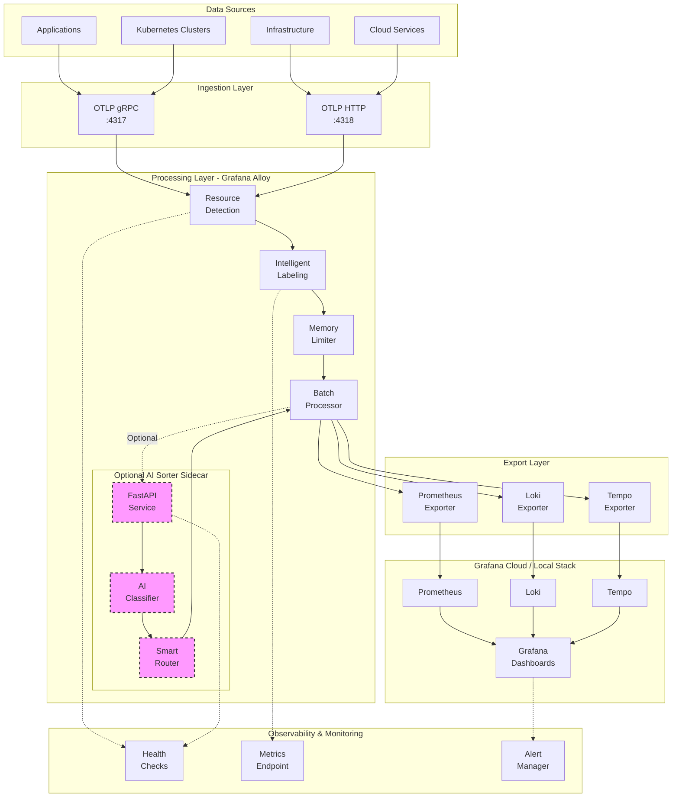

### Component Responsibilities

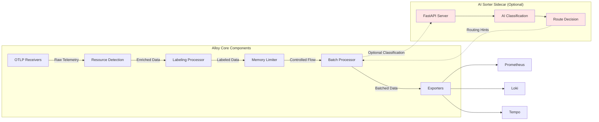

## Key Features

### Core Capabilities

1. **Multi-Protocol Ingestion**
   - OTLP gRPC (port 4317)
   - OTLP HTTP (port 4318)
   - Support for logs, metrics, and traces

2. **Advanced Processing Pipeline**
   - Automatic resource detection (K8s, Docker, cloud providers)
   - Intelligent labeling and enrichment
   - Memory-aware buffering and batching
   - Performance optimization with configurable workers

3. **Optional AI-Driven Sorting** (Feature Flag: `AI_SORTER_ENABLED`)
   - AI-powered classification of telemetry data
   - Smart routing based on severity/priority
   - Integration with xAI Grok API
   - Fail-safe operation (defaults to standard routing if AI fails)

4. **Production-Ready Features**
   - Comprehensive health checks and readiness probes
   - Prometheus metrics for observability
   - Security hardening (non-root containers, read-only FS)
   - Multi-arch image support (amd64, arm64)
   - SBOM generation and image signing

5. **Flexible Deployment Options**
   - Local development with Docker Compose
   - Kubernetes via Helm charts
   - Support for Grafana Cloud and self-hosted stacks

## Component Architecture

### Alloy Processing Pipeline

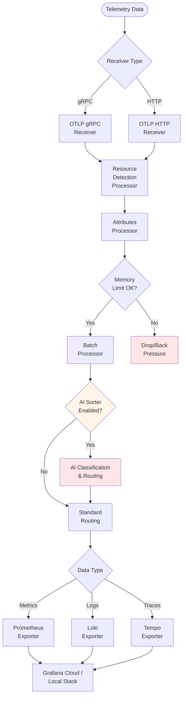

### AI Sorter Sidecar Architecture

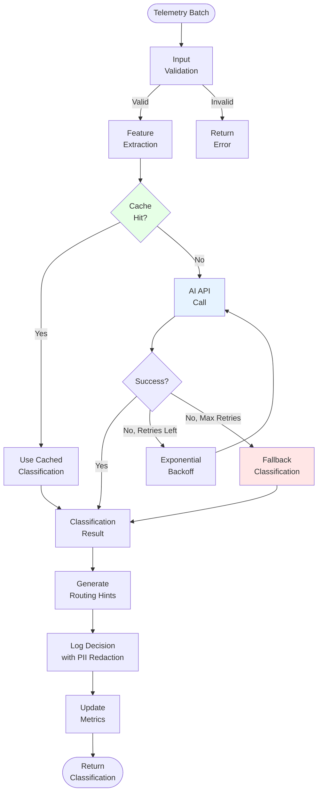

## Data Flow

### Telemetry Data Journey

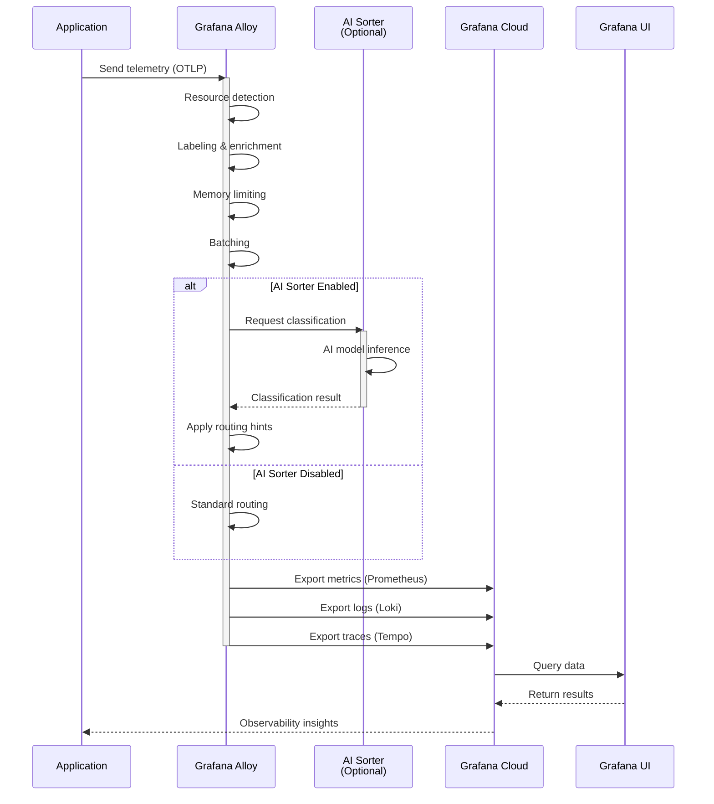

## Deployment Models

### Local Development (Docker Compose)

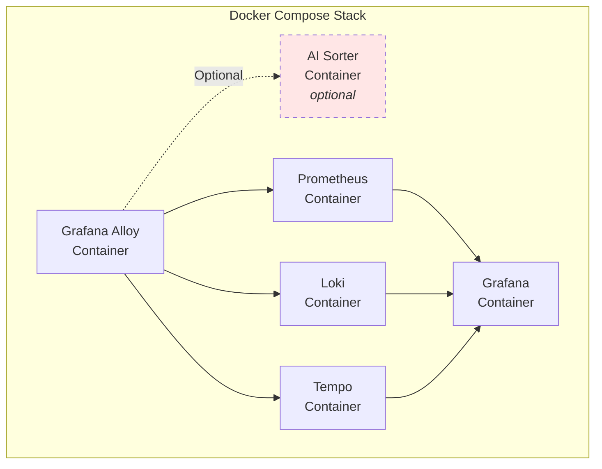

### Kubernetes Production Deployment

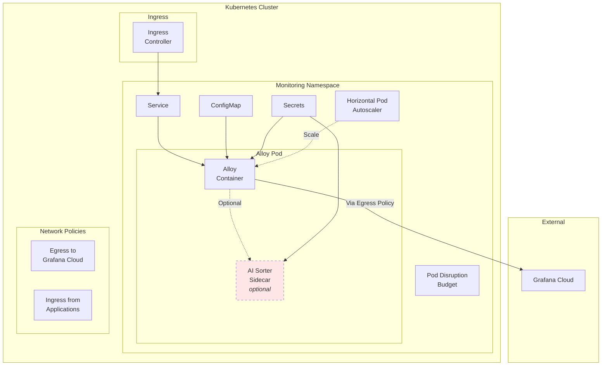

## Security Architecture

### Security Layers

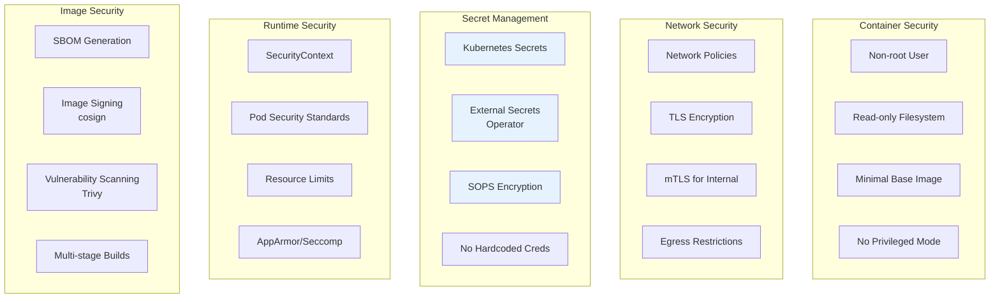

### Security Controls

| Layer | Control | Implementation |
|-------|---------|----------------|
| Container | Non-root execution | `runAsUser: 10001`, `runAsNonRoot: true` |
| Container | Read-only root FS | `readOnlyRootFilesystem: true` |
| Container | Drop capabilities | `drop: ["ALL"]` |
| Network | TLS for exporters | Configured in Alloy exporters |
| Network | Network policies | Restrict ingress/egress |
| Secrets | No plaintext secrets | Use Kubernetes Secrets or External Secrets |
| Secrets | API key rotation | Regular rotation policy |
| Supply Chain | Image signing | Cosign keyless OIDC |
| Supply Chain | SBOM | Syft generation in CI |
| Supply Chain | Vulnerability scanning | Trivy in CI pipeline |

## Integration Points

### Grafana Cloud Integration

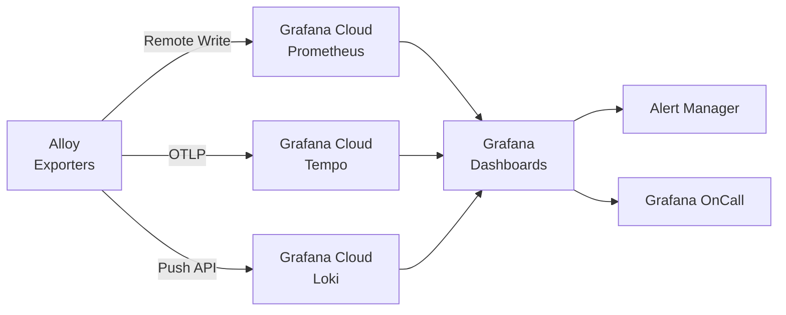

### Data Sources Integration

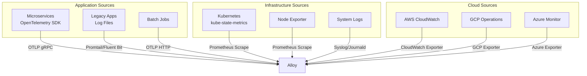

## Scalability & Performance

### Horizontal Scaling Strategy

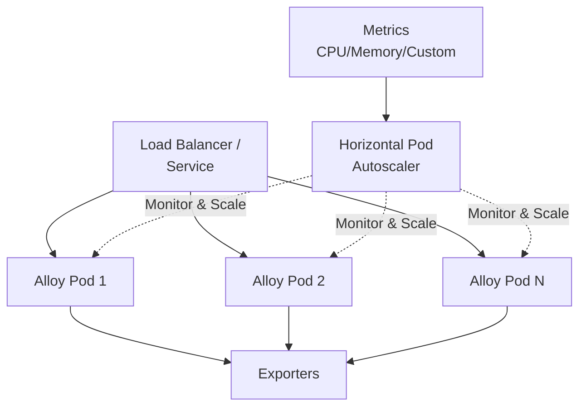

### Performance Characteristics

| Component | Throughput | Latency | Resource Usage |
|-----------|------------|---------|----------------|
| OTLP Receiver | ~50K spans/sec | < 10ms p95 | 500MB RAM |
| Batch Processor | Configurable | Batch timeout | Memory-limited |
| AI Sorter (optional) | ~1K req/sec | < 200ms p95 | 1GB RAM |
| Prometheus Exporter | 10K samples/sec | < 50ms p95 | Minimal |

## Getting Started

### Quick Start (Local)

1. **Clone and configure**
   ```bash
   git clone <repository-url>
   cd alloy-dynamic-processors
   cp .env.example .env
   # Edit .env with your configuration
   ```

2. **Deploy with Docker Compose**
   ```bash
   make up
   # or
   docker-compose up -d
   ```

3. **Verify health**
   ```bash
   curl http://localhost:13133/healthz
   ```

### Production Deployment (Kubernetes)

1. **Prepare Helm values**
   ```bash
   cp alloy/helm/alloy-dynamic-processors/values.yaml my-values.yaml
   # Edit my-values.yaml
   ```

2. **Deploy with Helm**
   ```bash
   helm install alloy-processors ./alloy/helm/alloy-dynamic-processors \
     -f my-values.yaml \
     --namespace monitoring \
     --create-namespace
   ```

3. **Verify deployment**
   ```bash
   kubectl get pods -n monitoring
   kubectl port-forward -n monitoring svc/alloy-processors 13133:13133
   curl http://localhost:13133/healthz
   ```

## Next Steps

- [Detailed Architecture Documentation](./ARCHITECTURE.md)
- [Deployment Guide](./DEPLOYMENT_GUIDE.md)
- [Integration Patterns](./INTEGRATION_PATTERNS.md)
- [Security Best Practices](../SECURITY.md)
- [Contributing Guide](../CONTRIBUTING.md)

## Support

For issues, questions, or contributions, please refer to:
- GitHub Issues: [Report bugs or request features]
- Documentation: [Full documentation in `/docs`]
- Security: [See SECURITY.md for reporting vulnerabilities]
